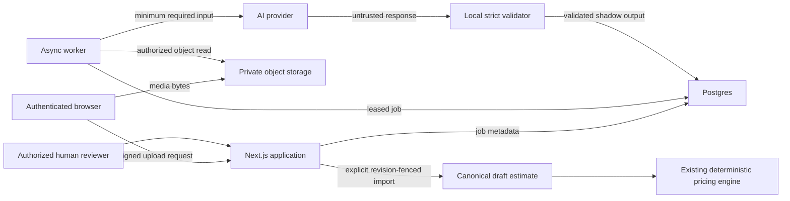

# AI Estimator Schema and Threat Model

Status: pre-migration design contract  
Parent proposal: `docs/AI_ESTIMATOR_ARCHITECTURE.md`  
Branch: `beta/estimating-core`  
Date: 2026-08-10

## Scope

This document freezes the first implementation boundary for AI Estimator. It
does not authorize a database migration, provider purchase, production upload,
or canonical estimate write.

V0 accepts a private narrated jobsite video attached to an existing lead,
transcribes its audio, extracts cited scope and measurement candidates into a
shadow draft, records human corrections, and prepares an explicit import into a
canonical draft estimate. The existing estimate calculation engine remains the
only price authority.

The first code slice may implement the extraction contract, validation,
provider interfaces, and tests without selecting an AI vendor or changing an
estimate API.

## Trust boundaries



Trust levels:

- Browser input is untrusted even after authentication.
- Uploaded files are untrusted until signature, size, and media validation.
- Provider output is untrusted even when structured-output mode is used.
- AI confidence is metadata, not verification.
- Service-role access is trusted only after an application authorization check.
- Canonical estimate calculations and transactional correspondence checks are
  the money authority.
- Customer-safe projection code is the only boundary allowed to produce a
  customer-facing estimate document.

## Proposed database contract

All names are reserved proposals. A later migration must be additive,
default-off, and reviewed against the then-current schema before execution.

### Common rules

- Use UUID primary keys generated by Postgres.
- Use `timestamptz` for events and processing times.
- Use decimal strings at API/provider boundaries and constrained `numeric`
  columns only where database comparisons are needed.
- Enable RLS on every table.
- Revoke all table access from `public`, `anon`, and `authenticated`; route
  access through authorized server APIs until tenant-aware direct policies are
  deliberately designed.
- Grant only the required operations to `service_role`.
- Never put API keys, signed URLs, raw access tokens, or provider credentials in
  a table.
- Immutability is enforced with grants/triggers or write-only RPC contracts, not
  merely UI convention.

### `ai_estimator_cases`

Purpose: one isolated intake/review workspace.

Proposed columns:

| Column | Type | Contract |
| --- | --- | --- |
| `id` | `uuid` | Primary key. |
| `lead_id` | `uuid not null` | FK to `leads(id)`; required in V0. |
| `customer_id` | `uuid null` | FK to `customers(id)`; validated against lead. |
| `project_id` | `uuid null` | FK to `projects(id)`; validated against customer. |
| `target_estimate_id` | `uuid null` | FK to `estimates(id)`; must match case context. |
| `status` | `text` | `intake`, `processing`, `review_ready`, `in_review`, `approved`, `applied`, `archived`, `cancelled`. |
| `title` | `text` | Nonempty reviewer-visible label. |
| `retention_policy_version` | `text` | Version selected at creation. |
| `created_by_auth_user_id` | `uuid` | Auth actor, not provider identity. |
| `created_at`, `updated_at` | `timestamptz` | Audit times. |

Required constraints:

- A target estimate must be connected to the same lead/customer/project chain.
- `applied` requires a successful application record.
- Processing state cannot mutate the linked lead or estimate status.
- Deleting a lead should be restricted while a retained case exists; use the
  approved business-retention workflow rather than an implicit cascade.

### `ai_estimator_assets`

Purpose: metadata and retention state for original and derived private objects.

Proposed columns include case ID, optional parent asset ID, kind, origin,
private bucket/path, external provider reference, safe original filename, MIME
type, bytes, SHA-256, capture time, duration, page/pixel metadata, spatial
metadata JSON, lifecycle status, retention deadline, deletion time, and creator.

Object identity is `(bucket, path)` under a case/asset-specific prefix. Store no
permanent public URL. A derived object references its parent. External
Matterport references use an explicit kind and provider metadata rather than a
pretend storage path.

### `ai_estimator_processing_runs`

Purpose: durable state machine and retry boundary.

Proposed columns include case, run number, status, stage, idempotency key,
pipeline/schema/prompt versions, selected asset IDs, lease owner/expiry,
attempt count, sanitized failure code, output revision ID, and timestamps.

Required uniqueness:

- `(case_id, run_number)`;
- idempotency key within the case; and
- at most one actively leased attempt for a run.

Workers claim with an atomic function that checks status and lease expiry. A
worker heartbeat extends the lease. Completion validates lease ownership and
is idempotent. A crashed worker may be reclaimed after expiry. Cancellation is
terminal unless a user creates a new run.

### `ai_estimator_model_calls`

Purpose: provider audit, reproducibility, and cost accounting.

Store run, purpose, provider, model alias/snapshot, region, adapter version,
request/response hashes, provider request ID, prompt/schema version, latency,
retry, finish state, normalized usage metrics, estimated/reported cost,
retention mode, and provider-file deletion status.

Default retention excludes raw provider prompts/responses. If diagnostic raw
payload retention is later approved, it belongs in encrypted private storage
with a short deadline and a database pointer.

### `ai_estimator_transcripts`

Purpose: immutable transcript version.

Store run, source asset, version, language, normalized text, duration, provider
metadata, content hash, and creation time. A correction creates another
transcript/value record; it does not update the provider output.

### `ai_estimator_transcript_segments`

Purpose: resolvable spoken evidence.

Store transcript, ordinal, start/end milliseconds, speaker label, text,
language, normalized confidence, and bounded provider metadata. Enforce
nonnegative ordered time ranges and unique ordinals per transcript.

### `ai_estimator_draft_revisions`

Purpose: immutable validated extraction snapshot.

Store case, processing run, schema version, extraction JSON, content hash,
summary counts, and creation time. One completed processing run references one
revision. Updates and deletes are forbidden through ordinary application paths.

### `ai_estimator_facts`

Purpose: stable identity and immutable AI observation.

Proposed columns:

- case, run, draft revision, run-local fact ID, kind, semantic key, label;
- original value JSON and unit;
- dimension, source type, verification state, normalized confidence;
- source asset and evidence locator JSON;
- contradiction group, blocking flag;
- derivation formula/version/input fact IDs where applicable; and
- creation time.

`verification_state = 'verified'` is invalid for an AI-original fact. A derived
fact requires input fact IDs and a versioned formula. A non-derived fact cannot
claim a derivation. Every non-derived provider fact requires resolvable source
evidence.

### `ai_estimator_fact_values`

Purpose: append-only accuracy lineage.

Proposed columns include fact, stage, typed value JSON, unit, verification
state, source/reference, actor or processing run, superseded value ID, reason,
and creation time.

Stages:

```text
ai_original | human_corrected | final_estimate | final_actual
```

The initial value is inserted in the same transaction as the fact. Later
values append. A view may project the latest human value, but there is no
destructive “current value” update.

### `ai_estimator_review_events`

Purpose: append-only workflow audit.

Actions include accept, modify, reject, answer, waive, merge, split, reorder,
approve, preview, and apply. Store actor, target kind/ID, old/new value IDs,
reason, review-session ID, and timestamp. Events cannot contain raw media URLs
or long transcript content.

### `ai_estimator_applications`

Purpose: one previewed and explicit canonical import attempt.

Store case, approved review hash, preview hash, target estimate, expected and
resulting calculation revision, actor, status, failure code, section/item
mapping JSON, and timestamps.

The eventual application RPC is all-or-nothing and must:

1. authorize the actor at the server boundary;
2. verify context relationships;
3. require a structured estimate in `draft`;
4. require the expected calculation revision;
5. re-create and compare the approved review/preview hash;
6. reject every monetary value from AI-domain input;
7. fetch approved company/catalog pricing inputs separately;
8. invoke existing calculation and correspondence validation; and
9. insert the successful application/mappings in the same transaction.

### `ai_estimator_outcome_links`

Purpose: reviewed mappings to frozen final estimates and actual sources.

This entity is deferred until the active core application confirms its actual
material/labor/cost model. It must not be simulated by editing `project_costs`
or fuzzy-matching descriptions without review.

## API contract proposal

Future routes are namespaced and cannot replace current estimate routes:

```text
POST   /api/ai-estimator/cases
GET    /api/ai-estimator/cases/:caseId
POST   /api/ai-estimator/cases/:caseId/assets/upload-session
POST   /api/ai-estimator/cases/:caseId/assets/:assetId/complete
POST   /api/ai-estimator/cases/:caseId/runs
POST   /api/ai-estimator/cases/:caseId/runs/:runId/cancel
GET    /api/ai-estimator/cases/:caseId/review
POST   /api/ai-estimator/cases/:caseId/review/events
POST   /api/ai-estimator/cases/:caseId/import-preview
POST   /api/ai-estimator/cases/:caseId/apply
```

All responses use `Cache-Control: no-store`. IDs are validated before database
queries. Unsupported fields cause `400`; they are not ignored. Errors exposed
to users are generic enough to avoid cross-case enumeration, while a redacted
internal code supports diagnosis.

Processing routes return `202` and durable state. They do not hold a request
open for media processing. Provider callbacks, if used, are separately
authenticated, replay-protected, and idempotent.

## Storage policy proposal

Bucket: `ai-estimator-private` (name subject to review).

V0 allows configured video/audio types only. The application creates a short
signed upload constrained to the exact case/asset path, size, MIME allowlist,
and checksum. Completing an upload verifies object existence, byte size,
signature-detected type, and hash before the asset becomes available.

Reads require the same case authorization used by the review page. A signed
read is short-lived and scoped to one object. Browser listing is unavailable.
Workers receive service credentials restricted to the bucket and validate that
database ownership matches the requested prefix before any read/delete.

Deletion is a state machine:

```text
available -> deletion_pending -> deleted
```

The deletion worker removes provider-hosted copies, derived objects, then the
original according to policy; records the results; and retries partial
failures. Legal hold blocks this transition. Database facts may remain only as
allowed by the approved retention policy.

## Extraction response security contract

The checked-in schema is
`src/lib/ai-estimator/schemas/extraction-v0.schema.json`.

Local validation adds semantic checks JSON Schema cannot safely express:

- no prohibited money, pricing, structural, code, or engineering keys at any
  depth;
- unique IDs and valid internal references;
- source asset IDs limited to the declared run assets;
- evidence time ranges ordered and tied to known transcript segments;
- no `verified` AI observations;
- non-derived facts require evidence;
- derived facts require an explicit formula/version/input fact IDs;
- a populated quantity candidate requires source fact IDs;
- a null quantity is `unverified` and has no source fact IDs;
- questions resolve known unknown IDs; and
- all strings, arrays, and object counts are bounded before persistence.

The validator rejects the complete response on failure. It does not strip
unknown/prohibited fields and continue.

## Threat register

| Threat | Failure mode | Required mitigation |
| --- | --- | --- |
| Cross-case authorization | A user reads another customer's media/transcript. | Server authorization before service-role queries; opaque IDs; relationship checks; negative integration tests. |
| Public or leaked media URL | Long-lived URL exposes jobsite details. | Private bucket only; object path in DB; short single-object signed reads; redact logs. |
| Oversized/corrupt upload | Resource exhaustion or parser exploit. | Direct upload caps; magic-byte validation; quarantine; isolated worker; time/memory limits. |
| Prompt injection in narration/drawing | Source tells the model to set price or ignore rules. | Treat source as data; exact schema; recursive prohibited-key scan; no provider tools or canonical write capability. |
| Provider hallucination | Unsupported scope/quantity looks authoritative. | Resolvable evidence required; confidence separate from verification; human review; unknown-first behavior. |
| Price contamination | Model returns cost, markup, tax, or total. | Prohibit and reject monetary keys; separate request/response types; canonical service fetches pricing independently. |
| Partial canonical import | Some items write before a later failure. | One transaction/RPC with revision fence, idempotency, and calculation correspondence. |
| Stale review apply | Estimate or review changed after preview. | Expected calculation revision plus approved review and preview hashes. |
| Retry duplication | Provider callback/worker creates duplicate facts/import. | Case-scoped idempotency keys; immutable completed runs; unique application key. |
| Worker lease theft | Two workers complete the same run. | Atomic leases with owner/expiry; owner checked on heartbeat/completion. |
| Service-role escalation | Worker/app bypasses user access. | Keep provider worker endpoints non-user-facing; authorize application operations first; narrow credentials and queries. |
| Provider retention drift | Vendor retains data beyond McKenzie policy. | Versioned provider policy configuration; DPA review; delete hosted files; reconciliation and audit. |
| Sensitive telemetry | Transcript/URLs/PII enter logs or analytics. | Structured redacted logs; allowlisted metadata; no request-body logging. |
| Supply-chain media parser risk | FFmpeg/OCR library exploit. | Patched pinned runtime, isolated process/container, no broad filesystem/network credentials. |
| Structural/code advice | AI output is mistaken for engineering judgment. | Schema prohibition, UI warning, review policy, no code/structural output fields. |
| Model regression | Alias silently changes behavior. | Record snapshot, prompt/schema version; frozen evaluation set; release thresholds. |
| Data deletion gap | Storage/provider copy survives user deletion. | Durable deletion state, provider reconciliation, backup policy, auditable completion. |
| Actuals misattribution | Fuzzy mapping makes inaccurate model evaluation appear authoritative. | Reviewed many-to-many mappings; distinguish candidate vs verified mappings. |

## Safety invariants

The implementation must have automated tests proving:

- A model response cannot contain or influence price, cost, markup, margin,
  overhead, tax, discount, or contract value.
- A processing run cannot call proposal, contract, project creation, project
  activation, lead transition, or material-ordering paths.
- A model cannot mark its own fact `verified`.
- No canonical write occurs before an explicit human application request.
- Application is rejected for non-draft estimates, stale calculation revisions,
  changed review hashes, inconsistent relationships, or missing authorization.
- Original AI values and human corrections both remain queryable.
- Customer-safe estimate projections contain no transcript, provider, evidence,
  internal confidence, or raw-media fields.

## Decisions that can remain configurable

These choices do not block the first contract/validator implementation:

- transcription and extraction vendor;
- exact asynchronous worker host;
- initial upload size/duration limits;
- raw-media retention days; and
- whether diarization is enabled.

They block production processing and must be approved before enabling the
feature for real customer data.

## Safe first implementation slice

Without a migration or provider choice, implement:

1. versioned extraction JSON Schema;
2. TypeScript domain types;
3. strict recursive and semantic validator;
4. provider-neutral request/response interfaces;
5. prohibited-field and safety-boundary tests; and
6. build/typecheck verification.

This slice is isolated from production estimating and makes the most important
trust boundary executable before infrastructure work begins.
