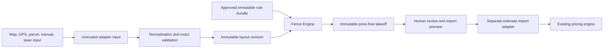

# Fence Engine Domain Contract

Status: normative design contract; not production code

Repository: `mmckenz7/McKenzie-Construction`

Branch audited: `beta/estimating-core`

Contract date: 2026-08-10

Related documents:

- `docs/FENCE_MAPPING_ENGINE_ARCHITECTURE.md`
- `docs/FENCE_MAPPING_ENGINE_V0_PLAN.md`
- `docs/FENCE_SYSTEM_V0_RULE_INTAKE.md`

## Purpose

This document defines the provider-neutral boundary shared by the future fence
map editor, persistence layer, deterministic takeoff engine, and estimate
import adapter.

It deliberately does not define McKenzie construction values such as panel
width, post spacing, footing size, gate hardware, waste, or labor production.
Those values must come from an approved Fence System V0 Rule Intake packet.

The contract makes these guarantees:

- map, GPS, parcel, and storage-provider objects never enter the engine;
- all authoritative construction dimensions are nonnegative integer
  millimeters serialized as strings;
- every accepted measurement retains source and verification provenance;
- gates are explicit openings and assemblies, never linear-footage deductions;
- immutable layout and rule inputs produce deterministic, hash-bound output;
- every takeoff quantity traces to geometry plus an approved rule path;
- blockers fail closed;
- no cost, price, tax, markup, discount, profit, or supplier offer is accepted
  or produced.

## Normative language

`MUST`, `MUST NOT`, `SHOULD`, and `MAY` describe contract requirements. A future
implementation may use different internal types only if its serialized inputs,
validation outcomes, hashes, and takeoff results remain equivalent to this
contract.

## Trust boundaries



The map editor may preview incomplete drafts. Only an immutable, normalized,
valid layout revision can be a takeoff input. Only an approved price-free
takeoff can be an estimate import input.

## Scalar encoding

### Domain IDs

A persisted domain ID MUST be a lowercase RFC 4122 UUID string:

```text
xxxxxxxx-xxxx-xxxx-xxxx-xxxxxxxxxxxx
```

The contract does not require one UUID version, but each creation path MUST use
one approved version consistently. IDs are opaque and MUST NOT encode company,
estimate, location, fence type, or sequence.

Test-only fixture IDs may use stable local identifiers only inside a fixture
loader. They MUST be transformed to or validated separately from persisted
domain IDs and MUST NOT seed application data.

### Integer millimeters

Every authoritative physical dimension uses `MillimeterString`:

```text
^(0|[1-9][0-9]*)$
```

Examples of fields using this type include:

- segment and run length;
- gate clear opening and leaf width;
- panel/bay width and post spacing;
- post, footing, rail, picket, and clearance dimensions;
- derived volumes after conversion to the rule's integer/fixed-point unit.

JSON numbers and decimal strings are forbidden for these dimensions. The
implementation parses them to `bigint` or an equivalent arbitrary-precision
integer and performs range checks before arithmetic or persistence.

Negative zero, signs, whitespace, leading zeroes, decimals, exponent notation,
`NaN`, and infinity are invalid.

### Counts and ordered positions

Small nonnegative counts and `sortOrder` values MAY be JSON integers only when
they are safe integers and within an explicitly validated bound. Any value used
in multiplication, division, unit conversion, or quantity calculation SHOULD
use a decimal/integer string and exact arithmetic.

### Fixed-point quantities

Non-length quantities use a normalized unsigned fixed-point decimal string:

```text
^(0|[1-9][0-9]*)(\.[0-9]+)?$
```

Each field defines its maximum scale. Normalization removes unnecessary trailing
fractional zeroes and removes the decimal point when no fractional digits
remain. Quantity calculation MUST NOT pass through JavaScript `number`.

### Coordinates

Accepted coordinates use WGS84 longitude/latitude decimal strings with exactly
seven fractional digits:

```ts
type NormalizedCoordinate = {
  longitude: string; // -180.0000000 through 180.0000000
  latitude: string;  //  -90.0000000 through  90.0000000
};
```

Rules:

- longitude and latitude MUST be finite decimal input before normalization;
- longitude MUST be in `[-180, 180]` and latitude in `[-90, 90]`;
- both MUST serialize with exactly seven fractional digits;
- negative zero normalizes to `0.0000000`;
- coordinate rounding uses the contract's explicit half-away-from-zero rule;
- a provider's raw coordinate remains an observation and MUST NOT be rewritten;
- quantization creates a separate accepted/derived value linked to its source.

Seven fractional digits are a serialization precision, not an accuracy claim.
The UI must continue to show the actual measurement source and reported
accuracy where available.

### Time

Audit and capture times use UTC RFC 3339 strings with a `Z` suffix and
millisecond precision. Times do not affect geometry or takeoff arithmetic. Only
times explicitly listed in a hash projection participate in that hash.

### Text and enums

- Enum values are stable lowercase snake-case ASCII strings.
- Required human text is trimmed, nonempty, and length bounded.
- Notes are display/audit metadata and MUST NOT control engine behavior.
- Rule behavior may be selected only through validated typed fields and enums,
  never parsed from prose.

## Version identifiers

Every immutable calculation input and output records explicit versions:

| Field | Purpose |
| --- | --- |
| `layoutSchemaVersion` | Shape and validation semantics of the layout document. |
| `coordinatePolicyId` | Coordinate quantization and normalization. |
| `geodesicPolicyId` | WGS84 segment-distance algorithm and rounding. |
| `ruleSchemaVersion` | Typed physical-rule document contract. |
| `takeoffPolicyVersion` | Bay/post/gate/component calculation semantics. |
| `canonicalizationVersion` | Hash projection and JSON canonicalization. |
| `importContractVersion` | Later mapping into canonical estimate items. |

V0 proposed identifiers:

```text
fence-layout-v1
wgs84-coordinate-7dp-v1
wgs84-geodesic-mm-v1
fence-system-rules-v1
fence-takeoff-v1
fence-canonical-json-v1
fence-estimate-import-v1
```

Publishing these identifiers does not approve physical rule values. Once an
identifier is used by an approved layout/takeoff, its semantics are immutable.
A behavior change requires a new identifier and new golden outputs.

## Measurement provenance contract

### Source

```ts
type MeasurementSource =
  | "aerial_map"
  | "customer_drawn"
  | "gps"
  | "parcel"
  | "manual"
  | "laser"
  | "derived";
```

### Verification

```ts
type VerificationState =
  | "preliminary"
  | "estimated"
  | "field_verified"
  | "manually_corrected";
```

### Observation reference

```ts
type MeasurementProvenance = {
  source: MeasurementSource;
  verification: VerificationState;
  observationId: string | null;
  correctionId: string | null;
};
```

Rules:

- `gps`, `parcel`, `manual`, and `laser` accepted values MUST reference an
  observation.
- `manually_corrected` accepted values MUST reference a correction.
- `derived` values MUST identify their input subject IDs and derivation policy
  in the calculation trace.
- Source and verification are independent. A source does not imply a
  verification level.
- Confidence or reported GPS accuracy MUST NOT silently change verification.
- Original observations and corrections are append-only.

### GPS observation

The core engine never consumes raw GPS observation arrays. Persistence and
field-review services may store:

```ts
type GpsObservation = {
  id: string;
  rawLongitude: string;
  rawLatitude: string;
  accuracyMeters: string;
  altitudeMeters: string | null;
  altitudeAccuracyMeters: string | null;
  headingDegrees: string | null;
  speedMetersPerSecond: string | null;
  capturedAt: string;
};
```

The accepted normalized coordinate points back to the selected/derived
observation. Device/browser details, photos, voice, and notes remain outside
the calculation projection.

## Layout revision contract

### Root

```ts
type FenceLayoutRevisionInput = {
  layoutSchemaVersion: "fence-layout-v1";
  coordinatePolicyId: "wgs84-coordinate-7dp-v1";
  geodesicPolicyId: "wgs84-geodesic-mm-v1";
  layoutId: string;
  revisionId: string;
  parentRevisionId: string | null;
  estimateId: string;
  nodes: readonly FenceNodeInput[];
  runs: readonly FenceRunInput[];
  openings: readonly FenceOpeningInput[];
};
```

The calculation projection excludes address, provider token/reference, imagery
style, camera position, UI state, notes, actors, and timestamps. Those fields
belong to persistence/audit projections.

### Nodes

```ts
type FenceNodeKind =
  | "start"
  | "end"
  | "corner"
  | "terminal"
  | "gate_start"
  | "gate_end"
  | "fence_transition"
  | "grade_break"
  | "custom";

type FenceNodeInput = {
  id: string;
  kind: FenceNodeKind;
  coordinate: NormalizedCoordinate;
  provenance: MeasurementProvenance;
};
```

A node is a meaningful topological event. It does not directly assert that one
physical post exists. The post resolver emits zero, one, or multiple
`postInstance` results from adjacent demands and approved rules.

V0 does not support degree-three-or-higher junctions unless Gate 0 adds and
approves a typed junction rule. A `custom` node cannot bypass that blocker.

### Run vertices

```ts
type FenceRunVertexInput = {
  id: string;
  coordinate: NormalizedCoordinate;
  provenance: MeasurementProvenance;
};
```

Vertex order is authoritative. Vertex IDs are stable across a revision diff
when the logical accepted point remains the same.

### Runs

```ts
type FenceRunInput = {
  id: string;
  sortOrder: number;
  fromNodeId: string;
  toNodeId: string;
  vertices: readonly FenceRunVertexInput[];
  fenceSystemVersionId: string;
  slopeMode: "level" | "rack" | "step" | "unknown";
  manualLengthOverride: ManualLengthOverride | null;
};

type ManualLengthOverride = {
  lengthMm: string;
  provenance: MeasurementProvenance;
  reasonCode: string;
};
```

Run rules:

- `fromNodeId` and `toNodeId` MUST resolve to different nodes.
- At least two vertices are required.
- The first/last vertex coordinates MUST exactly equal the normalized
  from/to-node coordinates.
- Consecutive vertices MUST NOT share a coordinate.
- A run MUST have positive derived and effective length.
- A run owns one approved fence-system version.
- A transition divides runs with different system versions.
- A gate opening is not represented by a run and is never deducted from one.
- Manual override requires an observation/correction and approved reason code.
- The engine preserves both geometry-derived and effective length.

### Openings and gates

```ts
type GateKind =
  | "walk_gate"
  | "single_gate"
  | "double_drive_gate"
  | "custom";

type FenceOpeningInput = {
  id: string;
  sortOrder: number;
  startNodeId: string;
  endNodeId: string;
  clearWidthMm: string;
  widthProvenance: MeasurementProvenance;
  gateKind: GateKind;
  gateAssemblyVersionId: string;
};
```

Opening rules:

- nodes MUST be distinct and have kinds `gate_start` and `gate_end`;
- clear width MUST be positive;
- width MUST come from a reviewed measurement/derivation, not subtraction from
  total linear footage;
- the node pair MUST NOT also be connected by an installed fence run;
- gate assembly version MUST be approved and compatible with adjacent systems;
- double-drive gate expansion defaults to no center post unless the approved
  gate assembly version explicitly requires one;
- arbitrary material/hardware arrays are forbidden on the opening input.

## Topology validation

Validation occurs before length or takeoff calculation. It returns stable
machine codes plus subject IDs and paths. Display messages are not part of the
hash or engine behavior.

### Blocking codes

```text
duplicate_entity_id
missing_node_reference
same_run_endpoint
run_vertex_count_invalid
run_endpoint_coordinate_mismatch
duplicate_consecutive_vertex
zero_length_segment
zero_length_run
overlapping_run
run_crossing_without_node
unsupported_junction
node_kind_degree_mismatch
gate_node_kind_invalid
same_opening_endpoint
opening_width_zero
opening_overlaps_run
opening_assembly_missing
transition_system_mismatch
transition_not_required
slope_mode_unknown
manual_override_provenance_missing
```

### Degree rules

Default V0 expectations before system-specific rules:

| Node kind | Required topology |
| --- | --- |
| `start`, `end`, `terminal` | One adjacent run and no opening, unless an approved gate rule says otherwise. |
| `corner` | Two adjacent runs with a meaningful direction change. |
| `gate_start`, `gate_end` | One opening and normally one adjacent installed run. |
| `fence_transition` | Two adjacent runs with different approved system versions. |
| `grade_break` | Two adjacent runs and an approved non-level slope decision. |
| `custom` | Must resolve to an explicitly supported typed condition before approval. |

Multiple disconnected fence components MAY exist in one layout. Every component
must independently pass topology validation.

Direction-change tolerance, collinearity tolerance, and spatial intersection
policy belong to `fence-layout-v1` and must be specified/tested before code. They
cannot come from map zoom or screen pixels.

## Length derivation

### Segment policy

`wgs84-geodesic-mm-v1` means:

1. consume normalized WGS84 endpoint strings;
2. compute the inverse geodesic distance on the WGS84 ellipsoid using one
   pinned implementation and version;
3. convert meters to exact/fixed-point millimeters without an intermediate UI
   display value;
4. round each segment once to the nearest millimeter, ties away from zero;
5. sum integer segment millimeters for the run.

The selected geodesic implementation must pass published WGS84 reference
vectors and project-owned fixed regression vectors. Mapbox, Google, ArcGIS,
MapLibre, Turf, browser screen projection, or PostGIS MUST NOT independently
recalculate the authoritative saved value unless it implements and passes this
same policy contract.

### Effective run length

```ts
type RunLengthResult = {
  runId: string;
  segmentLengthsMm: readonly string[];
  geometryLengthMm: string;
  manualLengthMm: string | null;
  effectiveLengthMm: string;
  effectiveSource: "geometry" | "manual" | "laser";
};
```

The engine uses the override only when its provenance and reason pass policy.
It never overwrites the geometry-derived length.

### Layout totals

```text
installedFenceLengthMm = sum(run.effectiveLengthMm)
gateOpeningLengthMm    = sum(opening.clearWidthMm)
alignmentLengthMm      = installedFenceLengthMm + gateOpeningLengthMm
```

These totals are distinct in storage, trace, and UI. Gates are neither omitted
from alignment length nor included in installed fence length.

## Rule bundle boundary

### Root

```ts
type FenceRuleBundleInput = {
  ruleSchemaVersion: "fence-system-rules-v1";
  takeoffPolicyVersion: "fence-takeoff-v1";
  systemVersions: readonly ApprovedFenceSystemVersion[];
  gateAssemblyVersions: readonly ApprovedGateAssemblyVersion[];
  componentMappings: readonly ApprovedComponentMapping[];
};
```

Every included version MUST have:

- stable domain ID and semantic version;
- status exactly `approved`;
- content hash computed from its behavior fields;
- effective/retired metadata outside behavior hash where appropriate;
- author and independent operational approval in audit storage;
- exact typed rules with no unknown keys.

### Prohibited rule behavior

Rule documents MUST NOT contain:

- executable JavaScript, SQL, regular-expression formulas, template code, or
  arbitrary expression strings;
- map/provider SDK objects;
- supplier SKUs as canonical component identity;
- unit costs, supplier prices, tax rates, markup, overhead, discounts, totals,
  profit, margin, or customer price;
- instructions parsed from notes or descriptions;
- default values invented by the engine when a required field is missing.

### Physical-rule typing

Exact discriminated unions for bay construction, remainder handling, post
compatibility, gate expansion, footing calculation, components, waste,
packaging, and labor are completed only after Gate 0. The contract requires
these general properties now:

- every rule variant has a stable `kind` enum;
- every required dimension is an integer string;
- every rule names its deterministic rounding/aggregation point;
- every component uses a semantic key and canonical catalog mapping;
- every unsupported combination produces a stable blocker;
- no catch-all `metadata` field changes calculation behavior.

## Takeoff result contract

### Root

```ts
type FenceTakeoffResult = {
  resultSchemaVersion: "fence-takeoff-v1";
  layoutRevisionId: string;
  layoutContentHash: string;
  ruleBundleHash: string;
  calculationInputHash: string;
  status: "blocked" | "valid";
  blockers: readonly FenceBlocker[];
  warnings: readonly FenceWarning[];
  runLayouts: readonly RunLayoutResult[];
  postInstances: readonly PostInstance[];
  gateInstances: readonly GateAssemblyInstance[];
  items: readonly FenceTakeoffItem[];
  resultHash: string;
};
```

If `blockers` is nonempty, status MUST be `blocked` and the result MUST NOT be
approved or imported. A blocked result MAY include partial diagnostic layouts,
but partial items MUST be marked diagnostic and excluded from `items`.

### Run layout

```ts
type RunLayoutResult = {
  runId: string;
  effectiveLengthMm: string;
  bayWidthsMm: readonly string[];
  internalPostOffsetsMm: readonly string[];
  decisionTraceIds: readonly string[];
};
```

Invariants:

- bay widths sum exactly to effective run length;
- every width satisfies its approved min/max policy;
- post offsets are positive, strictly increasing, and less than run length;
- one stable candidate/tie-break policy selects the result;
- layout order follows the run's from-to direction.

### Post instances

```ts
type PostRole =
  | "line"
  | "terminal"
  | "corner"
  | "transition"
  | "gate_hinge"
  | "gate_latch"
  | "gate_center"
  | "custom";

type PostInstance = {
  id: string;
  anchorKind: "node" | "run_offset" | "opening";
  anchorId: string;
  offsetMm: string | null;
  systemVersionId: string;
  role: PostRole;
  componentKey: string;
  footingRuleId: string;
  demandSourceIds: readonly string[];
  traceIds: readonly string[];
};
```

Post IDs are deterministic derived IDs within the result, generated from the
takeoff policy plus source anchors/demands. They are not database random IDs.
Multiple post instances may share a node only when an approved compatibility
rule requires them.

### Gate assembly instances

```ts
type GateAssemblyInstance = {
  id: string;
  openingId: string;
  assemblyVersionId: string;
  clearWidthMm: string;
  leafWidthsMm: readonly string[];
  hingePostInstanceIds: readonly string[];
  latchPostInstanceIds: readonly string[];
  centerPostInstanceIds: readonly string[];
  componentInstanceIds: readonly string[];
  traceIds: readonly string[];
};
```

For a double-drive assembly, `centerPostInstanceIds` MUST be empty unless the
approved assembly version contains the explicit condition that generated it.

### Takeoff items

```ts
type FenceTakeoffItem = {
  id: string;
  componentKey: string;
  classification: "material" | "labor" | "demo";
  materialCatalogId: string | null;
  laborCatalogId: string | null;
  rawQuantity: string;
  wasteQuantity: string;
  roundedPurchaseQuantity: string;
  unitCode: string;
  traceIds: readonly string[];
};
```

Exactly one catalog ID is normally present according to classification. Demo
may resolve to labor/material items through typed mappings. Missing required
catalog identity is a blocker, not a free-form item.

`rawQuantity`, `wasteQuantity`, and `roundedPurchaseQuantity` remain distinct so
physical waste and package rounding are visible. Estimate pricing waste is not
part of this result.

### Trace

```ts
type FenceTrace = {
  id: string;
  sourceType:
    | "layout"
    | "run"
    | "node"
    | "opening"
    | "bay"
    | "post_instance"
    | "gate_instance";
  sourceId: string;
  ruleVersionId: string;
  rulePath: string;
  formulaId: string;
  inputs: Readonly<Record<string, string>>;
  rawResult: string;
  roundingPolicyId: string | null;
  roundedResult: string;
  unitCode: string;
};
```

The production `inputs` schema becomes formula-specific typed data. It MUST
remain price-free, finite, exact, and stable ordered during serialization.

Every takeoff item MUST be explainable through one or more traces to original
run/node/opening inputs and approved rule paths.

## Blockers and warnings

### Structure

```ts
type FenceBlocker = {
  code: FenceBlockerCode;
  subjectType: string;
  subjectId: string;
  path: string;
};

type FenceWarning = {
  code: FenceWarningCode;
  subjectType: string;
  subjectId: string;
  path: string;
};
```

Messages are localized/display-layer content and excluded from hashes. Stable
codes and paths are included.

### Engine blocker codes

In addition to topology codes:

```text
measurement_verification_insufficient
manual_override_not_allowed
system_version_missing
system_version_not_approved
gate_assembly_not_approved
gate_system_incompatible
gate_width_unsupported
gate_configuration_unsupported
remainder_policy_unresolved
shortened_bay_below_minimum
post_compatibility_unresolved
slope_mode_unsupported
component_mapping_missing
catalog_identity_missing
unit_conversion_missing
pack_rounding_policy_missing
waste_policy_missing
labor_rule_missing
rule_hash_mismatch
calculation_overflow
```

### Warning codes

Initial cross-system warnings may include:

```text
measurement_preliminary
aerial_measurement_only
manual_length_override_used
parcel_context_present
shortened_panel_generated
custom_gate_requires_review
```

Warnings never grant permission or change quantities. A warning becomes a
blocker only through a versioned approval policy, not UI choice.

## Canonicalization and hashes

### Hash format

All content hashes serialize as:

```text
sha256:<64 lowercase hexadecimal characters>
```

Hashing uses SHA-256 over UTF-8 bytes of the canonical JSON projection.

### Canonical JSON

`fence-canonical-json-v1` uses these rules:

1. validate the full typed object and reject unknown keys;
2. create the named calculation/hash projection;
3. normalize all scalar strings according to this contract;
4. sort object keys using the selected JSON canonicalization implementation;
5. sort unordered entity collections by stable ID;
6. preserve semantically ordered arrays such as run vertices, bay widths,
   leaves, and user-approved sequence;
7. sort set-like ID/code arrays lexicographically and reject duplicates;
8. exclude undefined values; use explicit `null` only where allowed;
9. forbid non-finite numbers, binary floats in calculation fields, dates not
   listed in the projection, maps, sets, class instances, and provider objects;
10. serialize to UTF-8 and hash once.

The implementation SHOULD use a reviewed JSON Canonicalization Scheme such as
[RFC 8785](https://www.rfc-editor.org/rfc/rfc8785) where its number/string
requirements match this stricter contract. Project tests own the final byte
vectors; switching libraries without changing bytes is allowed.

### Domain separation

Every hash projection includes a `hashDomain` value:

```text
mckenzie:fence:layout-content:v1
mckenzie:fence:rule-bundle:v1
mckenzie:fence:takeoff-input:v1
mckenzie:fence:takeoff-result:v1
mckenzie:fence:import-preview:v1
```

This prevents one valid JSON object from being misinterpreted as another hash
type.

### Required hashes

| Hash | Includes | Excludes |
| --- | --- | --- |
| Layout content | normalized nodes, runs, openings, provenance state, calculation policy IDs | address, map provider, camera, notes, actor/time |
| Rule bundle | approved physical behavior and canonical component mappings | price/supplier offers, display/audit metadata |
| Takeoff input | layout content hash, rule bundle hash, takeoff policy | mutable database timestamps |
| Takeoff result | normalized complete result except its own hash | review/application state |
| Import preview | takeoff result hash, target estimate ID/revision, exact intended canonical mapping and resolved price-basis references | UI state |

An edit to any included value invalidates all downstream approvals/previews.

## Deterministic derived IDs and ordering

Output IDs such as bay, post, gate-component, trace, and takeoff-item IDs use a
stable derivation from:

- takeoff policy version;
- output kind;
- source logical IDs;
- ordered position or semantic component key;
- approved rule version ID.

The production encoding may use UUID v5 or a hash-derived lowercase identifier,
but one method must be pinned before Gate 1 code. Derived IDs MUST NOT depend on
database insertion order, timestamps, random values, provider objects, or
localized descriptions.

Stable output order:

1. runs by `sortOrder`, then run ID;
2. positions along a run from from-node to to-node;
3. openings by `sortOrder`, then opening ID;
4. post roles by a policy-defined stable enum order;
5. items by classification, component key, catalog ID, and unit;
6. traces by their derived ID after source-semantic ordering.

## Monetary firewall

Fence layout, rule, and takeoff schemas recursively reject monetary fields.
Forbidden semantic keys include:

```text
cost
unitCost
price
unitPrice
supplierPrice
tax
taxRate
markup
overhead
discount
profit
margin
subtotal
totalPrice
customerPrice
currency
```

Case-insensitive and snake/camel variants are prohibited except for clearly
nonmonetary text that does not enter calculation; safer schemas avoid the terms
entirely.

Catalog IDs and physical purchase quantities are allowed. Supplier offer IDs,
current price observations, and estimate price-basis snapshots belong only to
the separate import/pricing adapter.

Fence Engine MUST NOT import `estimate-calculations.ts`, catalog price services,
supplier services, tax services, proposal services, or project activation code.

## Import handoff contract

The price-free takeoff hands these facts to a separate server-only adapter:

- approved takeoff ID and result hash;
- component semantic key;
- canonical material/labor catalog ID;
- raw/waste/purchase quantity and unit;
- trace IDs;
- requested section/grouping intent from an approved import policy.

The adapter adds, under existing authorization:

- target estimate ID and expected `calculation_revision`;
- active catalog/unit validation;
- approved price-basis selection;
- existing component-cost completeness semantics;
- item markup and estimate-level policy from canonical settings;
- exact section/item mutation preview;
- atomic estimate recalculation and persistence.

No field flowing from Fence Engine can override price, tax, markup, overhead,
discount, total, proposal state, lead lifecycle, or project activation.

## Persistence projections

The future database model may normalize a layout across tables, but it MUST be
able to reconstruct the exact canonical layout and takeoff documents verified
by their hashes.

Recommended separation:

- **calculation projection:** fields defined here and covered by content hash;
- **audit projection:** actor, time, parent revision, reason, approval;
- **provider projection:** geocoder/imagery/parcel references and licensed
  retention state;
- **private asset projection:** GPS point photos/voice paths and retention;
- **display projection:** address, notes, labels, colors, camera/UI state.

Do not store one mutable JSON blob as the only layout record. Do not allow
normalized relational rows and the hashed snapshot to diverge silently. A
write transaction must validate their correspondence or derive one canonical
snapshot from the other.

## API validation boundary

Every future request handler MUST:

1. authenticate and authorize linked estimate/layout access;
2. parse bounded request size before domain validation;
3. reject unknown keys and wrong schema/policy versions;
4. normalize once and return exact normalized values for review;
5. validate relationships/topology/rules on the server;
6. compare expected revision/hash/idempotency state;
7. write through a transactional server-only service;
8. return a permission-aware projection without provider secrets or hidden
   financial fields.

The client map may provide a preview, but the server recomputes every accepted
coordinate normalization, length, validation outcome, and hash.

## Size and resource limits

Exact V0 limits require product approval, but the schema MUST have finite bounds
for:

- nodes, runs, vertices per run, and openings per layout;
- disconnected components;
- notes and labels;
- rule versions and component mappings per calculation;
- traces and items per takeoff;
- JSON request/response size;
- geodesic segments and candidate bay layouts evaluated;
- integer dimension and multiplication ranges.

Limit failures use stable blocker/API error codes. The engine must avoid
unbounded candidate generation or rule recursion. Rule documents contain no
recursion.

## Contract test requirements

### Scalar and normalization

- coordinate range, exact seven-place serialization, and negative-zero cases;
- integer/fixed-point rejection of signs, leading zeroes, exponent notation,
  decimals at excessive scale, non-finite values, and whitespace;
- enum exactness and unknown-key rejection;
- timestamps excluded/included in the correct projections.

### Layout and topology

- duplicate/missing IDs and references;
- endpoint/vertex equality;
- zero/duplicate segments;
- run crossing/overlap;
- node degree rules and unsupported junction;
- transition system difference;
- gate opening/run exclusivity;
- double-gate explicit no-center-post default.

### Determinism

- fixed WGS84 geodesic reference vectors;
- per-segment millimeter rounding and exact sums;
- unordered input entity insertion produces identical canonical bytes;
- ordered vertex or bay change produces a different hash;
- same normalized input produces byte-identical result;
- any rule/geometry calculation-field change invalidates downstream hashes;
- display/audit-only change does not change calculation hash.

### Monetary firewall

- recursive prohibited monetary keys rejected from rules/layout/takeoff;
- engine module dependency test forbids estimate, supplier, price, tax,
  proposal, contract, and project-activation imports;
- result schema cannot represent money.

### Trace and invariants

- bay widths sum to effective run length;
- post offsets are ordered/in range;
- all post/gate/component/item IDs resolve;
- every item has trace to geometry and rule;
- aggregation preserves raw/waste/purchase quantities;
- nonempty blockers make approval/import impossible.

## Gate 0 fields still required

This contract intentionally cannot finalize these discriminated unions until a
real rule packet is approved:

- manufactured-panel versus stick-built bay candidate behavior;
- remainder and too-small-remainder variants;
- post-role compatibility/precedence and multi-post transitions;
- direction-change and collinearity tolerances;
- footing volume, aggregation, conversion, waste, and package policy;
- rail/picket/wire/fastener quantity formulas;
- slope rack/step behavior;
- gate leaf, clearance, post, hardware, and unsupported-condition variants;
- physical waste versus estimate pricing waste;
- demolition and labor production rules;
- canonical material/labor mappings and unit conversions;
- finite V0 size/resource limits based on real jobs.

The `FENCE_SYSTEM_V0_RULE_INTAKE.md` worksheet is the authoritative intake for
those decisions. No implementation should replace a missing answer with a
nominal industry default.

## Decisions fixed by this contract

The following decisions no longer depend on the physical fence system:

1. Engine inputs are provider-neutral immutable layout/rule documents.
2. WGS84 accepted coordinates serialize at seven decimal places.
3. Authoritative physical dimensions use integer-millimeter strings.
4. Geometry-derived and manual/laser effective lengths remain distinct.
5. Gate openings are explicit and never represented as installed fence runs.
6. Double gates create no center post without an explicit approved rule.
7. Source, verification, observation, and correction are retained separately.
8. Takeoff output is physical, traceable, deterministic, and price-free.
9. Hashes use canonical JSON, SHA-256, domain separation, and exact policy
   versions.
10. The estimate import adapter is a separate authorized transactional boundary.

Approval of this design contract authorizes only later implementation planning.
It does not authorize schema changes, production writes, deployment, commit, or
push.
