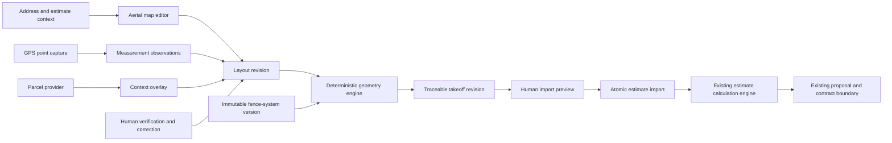

# Fence Mapping + Fence Engine Architecture Proposal

Status: architecture proposal only

Repository: `mmckenz7/McKenzie-Construction`

Branch audited: `beta/estimating-core`

Audit date: 2026-08-10
Implementation status: no schema migration or production-code change proposed here has been applied

## Executive recommendation

Build Fence Mapping + Fence Engine as a versioned geometry and deterministic
quantity subsystem beside the existing structured estimate builder.

The trust boundary should be:

```text
address / aerial drawing / GPS / parcel context
-> versioned fence layout
-> explicit human verification
-> versioned fence-system rules
-> deterministic post, panel, gate, material, and labor takeoff
-> reviewed import preview
-> existing draft estimate entities
-> existing deterministic pricing engine
```

Fence Engine owns physical intent and quantities. The existing McKenzie OS
estimate engine continues to own unit costs, waste pricing, material tax,
markup, overhead, discounts, customer price, profit, and proposal output.
Neither map providers, parcel providers, nor AI should calculate authoritative
quantities or money.

The smallest useful V0 is an internal estimator workflow:

1. Start from an existing draft estimate and its property address.
2. Open satellite imagery and draw/edit fence runs, corners, endpoints,
   transitions, and explicit gate openings.
3. Display segment and total fence length with an estimating-only warning.
4. Apply one approved, immutable fence-system rule version.
5. Produce a traceable post/panel/gate/material/labor takeoff preview.
6. Require human review, then atomically import approved quantities into the
   existing draft estimate without duplicating pricing logic.

Start with one real McKenzie fence system whose rules, SKUs, gates, footing
requirements, and labor units have been validated by the business. Do not ship
an abstract catalog of unverified example systems.

Defer parcel overlays, walk-the-line GPS, customer self-layout, offline field
capture, elevation-aware layout, and multi-system optimization until V0 proves
the geometry and takeoff contracts. The data model below deliberately preserves
those extension points.

## Repository audit

The repository was on `beta/estimating-core` for this pass. An unrelated
untracked `docs/AI_ESTIMATOR_ARCHITECTURE.md` was present and was not changed.
`npm install` completed with no reported vulnerabilities, and `npm run build`
completed successfully under Node `v24.19.0`, npm `11.17.0`, and Next.js
`16.3.0`.

No PostGIS extension declaration was found in the checked-in migrations. Do
not assume PostGIS is available until the target Supabase environments are
audited and a separately reviewed additive migration enables it. Fence V0 does
not need PostGIS to be correct.

### Existing entities to reuse

| Existing entity | Fence Engine reuse | Boundary |
| --- | --- | --- |
| `leads` | Preliminary business context and property address before conversion. | A layout must not change lead lifecycle or assignment. |
| `customers` | Customer context after conversion. | Preserve the existing `source_lead_id` relationship checks. |
| `projects` | Future installed/verified layout context after project activation. | Fence Engine must not create or activate projects. |
| `estimates` | Required V0 parent and target for an approved takeoff import. Reuse `lead_id`, `customer_id`, `project_id`, property address, draft status, and `calculation_revision`. | Only a draft structured estimate may receive an import. A layout is not a proposal or contract. |
| `estimate_sections` | Canonical grouping for imported fence scope, materials, labor, gates, demo, and allowances. | Geometry remains in Fence Engine tables; do not serialize it into section notes. |
| `estimate_line_items` | Canonical reviewed pricing inputs after import. Supports quantities to four decimal places, units, material/labor cost components, waste, markup, taxable state, and allowance rows. | Do not make this table the takeoff ledger. It cannot explain every post back to a run and rule by itself. |
| `material_catalog` | Approved material identities, units, base costs, waste defaults, supplier references, and metadata. | Fence rules point to catalog IDs; they do not copy current prices into rule definitions. |
| `labor_catalog` | Approved labor units, costs, crew size, and production rates. | Production rules create labor quantities; the existing catalog remains the price source. |
| `supplier_material_prices` and `estimate_material_price_snapshots` | Current supplier evidence and estimate-time material price snapshots. | These are pricing records, not geometry provenance. |
| `estimate_options` | Possible future good/better/best fence alternatives. | Options are deliberately inactive in the current structured core and must not be activated by V0. |
| `feature_settings` and workspace permissions | Gate future rollout and reuse Sales/estimate permissions. | Add a distinct default-off `fence_mapping` feature later; editing a layout and applying a takeoff need explicit permissions. |
| `lead_activities` / `project_activity` | Optional high-level audit messages after explicit user actions. | Detailed geometry, samples, formulas, and corrections need their own append-only audit records. |
| private storage patterns | Future point photos and voice annotations. | Never store permanent public URLs or sensitive media in activity text. |

### Existing code and API boundaries to reuse

| Existing code | Recommended reuse |
| --- | --- |
| `src/lib/estimate-calculations.ts` | Remains the sole money calculation authority. Fence Engine must not reproduce its material tax, markup, overhead, discount, price, profit, or margin formulas. |
| `src/lib/estimate-types.ts` | Reuse exact decimal-string conventions at the estimate-import boundary. Fence geometry should use its own integer dimension types. |
| `src/lib/estimate-persistence.ts` | Reuse canonical persistence and permission-aware projection after an approved import. |
| `src/lib/estimate-mutations.ts` | Reuse draft-only validation, complete calculation bundles, optimistic revision fencing, and post-mutation projection. Add one dedicated atomic takeoff-import transaction later instead of making many browser item calls. |
| `/api/estimates` | Reuse the relationship validation among lead, customer, and project and the single structured lead-draft behavior. |
| `/api/estimates/[estimateId]`, `/sections`, and `/items` | Reuse authentication and mutation conventions. Do not call these one at a time for a takeoff because partial imports are unacceptable. |
| `src/lib/estimate-access.ts` | Reuse Sales workspace authentication, estimate feature gating, and cost/profit/price permissions as the base for layout authorization. |
| `/api/material-catalog` | Reuse catalog administration and supplier-price concepts. Fence rule authoring should select approved IDs rather than accept free-form priced components. |
| customer proposal/presentation services | Preserve unchanged. Internal coordinates, parcel context, accuracy, field notes, and takeoff trace must not enter a public proposal unless a later customer-safe projection explicitly allows them. |

### Current integration constraints

- Structured estimate mutations are draft-only and protected by
  `calculation_revision`. Takeoff import must compare an expected revision and
  fail atomically on stale state.
- Current mutation projection writes compatibility mirrors and recalculates
  the complete estimate after every change. A multi-item takeoff needs one
  transaction/RPC and one recalculation, not a loop of REST mutations.
- `estimate_line_items` has `material_catalog_id` and `labor_catalog_id`, but
  the current canonical structured mutation bundle writes those fields as
  `null`. Before Fence Engine import depends on persistent catalog links, the
  main estimating track must deliberately extend that canonical contract.
- Null component costs mean unknown; a known non-applicable component is an
  explicit zero. Fence import must preserve this completeness rule.
- Material price snapshots are historical price evidence. They should be
  created through the existing pricing workflow only after canonical catalog
  resolution, never directly from fence-system rules.
- The application currently uses a global/default feature scope rather than a
  pervasive `company_id` on business tables. Tenant ownership must be resolved
  before any multi-company deployment or customer public access.

## Architectural principles

1. **Topology before takeoff.** A valid layout has explicit nodes, runs, and
   openings; it is not an anonymous polyline plus total length.
2. **Gates are assemblies.** A gate creates leaves, hinge/latch posts,
   hardware, clearances, and concrete requirements. It is never merely
   subtracted linear footage.
3. **Rules are immutable inputs.** A takeoff references an exact fence-system
   version and engine version. Later rule edits create a new version.
4. **Quantities are deterministic.** Identical normalized geometry and rule
   versions must produce byte-equivalent normalized takeoff output.
5. **Measurements retain provenance.** Original GPS, map, parcel, manual, and
   derived observations remain available after correction.
6. **Verification is independent of source.** A GPS point can remain
   preliminary; a manually corrected point can become field verified.
7. **Provider geometry is context, not truth.** Aerial imagery and parcel lines
   are not legal boundaries or survey measurements.
8. **Integer dimensions, explicit rounding.** Quantity math does not use
   uncontrolled binary floating point.
9. **One pricing authority.** Fence Engine produces physical quantities and
   catalog references; the estimate engine produces money.
10. **Human approval at trust transitions.** Customer intent, GPS capture, and
    parcel context do not silently become order quantities or estimate items.
11. **AI is advisory only.** AI may classify an annotation or suggest a fence
    system, but validated rules and deterministic code calculate the takeoff.

## Proposed system shape



### Runtime placement

- **Next.js application:** address search, provider-backed map display, layout
  editing, field capture, review, takeoff preview, and explicit import.
- **Fence domain library:** provider-neutral TypeScript types, topology
  validation, coordinate normalization, geodesic measurement, panel/post/gate
  layout, takeoff aggregation, trace generation, and stable serialization.
  Keep it free of React, Supabase, map SDK, and price logic.
- **Postgres:** business relationships, immutable revisions, normalized nodes
  and runs, rule versions, takeoff results, review decisions, and import maps.
- **Private object storage:** optional GPS-point photos and voice annotations.
- **Provider adapters:** map rendering/geocoding and parcel retrieval. Provider
  response shapes must not leak into the core geometry model.

## Geometry and measurement model

### Topology decision

Model a layout as a graph with ordered run geometry:

```text
Estimate
└── Fence Layout
    └── Layout Revision
        ├── Nodes
        ├── Runs
        │   └── Ordered vertices / segments
        ├── Openings
        │   └── Gate assembly configuration
        └── Measurement observations and corrections
```

A **node** is a meaningful topological event. A **vertex** is an ordered point
needed to describe a run's path. A corner, terminal, gate edge, fence-system
transition, or grade break is always a node. A GPS sample or minor bend can be
a vertex without forcing a new assembly rule. This separation prevents every
noisy GPS sample from creating a physical post while still preserving the
measured path.

A **run** is installed fence between two meaningful nodes under one fence
system version and one slope policy. Runs never cross a gate opening. The clear
distance between a gate-start and gate-end node belongs to the opening, so it
is not deducted again from a run.

### Coordinate and length contract

- Store accepted coordinates in WGS84 longitude/latitude, quantized to a
  documented precision such as seven decimal places. Preserve the provider or
  raw GPS values separately.
- Store rule dimensions, manual dimensions, computed segment lengths, and
  opening widths as integer millimeters. Convert to feet/inches only for UI and
  estimate units.
- Version the geodesic algorithm, coordinate quantization, and rounding policy.
  For V0, calculate each normalized WGS84 segment with one pinned ellipsoidal
  algorithm, round each segment once to the nearest millimeter using a stated
  half-away-from-zero rule, then sum integer segments.
- Never calculate authoritative length from screen pixels or Web Mercator map
  distance.
- Keep `geometry_length_mm`, optional `manual_length_mm`, and
  `effective_length_mm` distinct. A manual override requires a reason,
  observation source, actor, and verification state.
- A parcel polygon may be snapped to visually only after an explicit user
  action. Its vertices remain parcel-sourced, never field-verified by default.

### Source and verification vocabularies

Measurement source:

- `aerial_map`
- `customer_drawn`
- `gps`
- `parcel`
- `manual`
- `laser`
- `derived`

Verification state:

- `preliminary`
- `estimated`
- `field_verified`
- `manually_corrected`

`manually_corrected` describes how the accepted value changed; in a later
schema it may be cleaner to record correction state separately from assurance
state. Until that decision is made, store both the requested vocabulary and an
append-only correction event so meaning is not lost.

## Proposed entities

Names are proposals. Any migration must be additive, separately audited, and
reviewed against the production database before execution.

### `fence_layouts`

Stable workspace linked to one `estimate_id`. Optional lead/customer/project
links may be denormalized only if database constraints prove they agree with
the estimate.

Key fields:

- `id`, required `estimate_id`, title, status, current revision ID;
- geocoded address snapshot, longitude/latitude, geocoder/provider reference;
- workflow state: `draft`, `review_ready`, `verified`, `applied`, `archived`;
- created by, created at, and updated at.

V0 should allow one active layout per estimate unless a real alternate-layout
workflow is approved. Do not couple `applied` to estimate acceptance.

### `fence_layout_revisions`

Immutable snapshot identity for every saved geometry state used by a takeoff.

Key fields:

- layout ID, revision number, parent revision, and revision reason;
- normalized geometry hash, geometry engine version, and schema version;
- aggregate fence/alignment/opening lengths in integer millimeters;
- source summary and minimum verification state;
- created by and created at.

Editing creates a new revision. A takeoff never follows a mutable "latest"
pointer without recording the exact revision ID.

### `fence_nodes`

Meaningful topological locations within a layout revision.

Key fields:

- revision ID, stable logical key, node type, longitude, latitude;
- node types: `start`, `end`, `corner`, `terminal`, `gate_start`, `gate_end`,
  `fence_transition`, `grade_break`, and `custom`;
- source, verification, accepted observation ID, accuracy meters, captured at;
- optional note and rule-relevant metadata.

Do not assume one physical post per node. The post resolver decides whether a
node yields zero, one, or multiple post instances based on adjacent systems and
opening rules.

### `fence_runs` and `fence_run_vertices`

`fence_runs` stores ordered installed-fence edges between nodes:

- revision ID, from/to node IDs, order, stable logical key;
- fence-system-version ID and slope mode;
- geometry/effective length in integer millimeters;
- source, verification, and optional override reason.

`fence_run_vertices` stores the ordered accepted coordinates that form the
run. End vertices must match the referenced node coordinates. The engine derives
adjacent segments rather than persisting independently editable segment totals.

Topology validation rejects zero-length runs, duplicate consecutive vertices,
missing endpoints, self-references, gate spans also represented as fence, and
transitions that do not actually divide system assignments.

### `fence_openings` and `fence_gate_configurations`

An opening connects a gate-start node to a gate-end node and owns its clear
width. Gate configuration is an assembly snapshot, not a free-form note.

Key fields:

- opening type: `walk_gate`, `single_gate`, `double_drive_gate`, or `custom`;
- clear opening width and configured leaf count/widths in integer millimeters;
- hinge side, swing direction, latch side, grade clearance, and automation flag;
- gate-system-version ID or approved custom assembly version;
- post requirements for hinge/latch sides, hardware set, footing override;
- double-gate center-post policy, defaulting to `none` and requiring an
  explicit configured rule to create one;
- source, verification, note, and configuration hash.

Gate width must come from the opening or a reviewed rule. Do not infer it by
subtracting ambiguous map lines.

### `fence_measurement_observations`

Append-only evidence behind accepted nodes, vertices, opening widths, or manual
lengths.

Key fields:

- subject type/key and source;
- raw longitude/latitude, reported accuracy meters, altitude/altitude accuracy,
  heading, speed, capture timestamp, and device/browser metadata where supplied;
- raw provider reference or parcel feature ID and data vintage;
- optional private photo/voice asset IDs and note;
- recorded by and recorded at.

Provider terms may restrict storage of geocoding or parcel payloads. Store only
licensed fields and record the applicable provider/contract version.

### `fence_measurement_corrections`

Append-only decisions that select, replace, or manually correct an observation.
Store prior value, corrected value, reason, actor, verification state, and time.
Never overwrite the raw observation.

### `fence_systems` and `fence_system_versions`

`fence_systems` is the stable business identity such as "McKenzie 6-foot wood
privacy." `fence_system_versions` is an immutable, effective-dated rule set.

Key version fields:

- system ID, semantic version, status (`draft`, `approved`, `retired`),
  effective dates, author, reviewer, and content hash;
- height and core dimensions as integer millimeters;
- strict schema-validated rule document;
- compatibility tags for slope, gate families, transitions, and site conditions;
- notes describing the real-world installation standard being encoded.

Only approved versions may generate an importable takeoff. Historical layouts
continue to reference retired versions.

### `fence_system_components`

Relational mappings from a system version and semantic component key to an
approved `material_catalog_id` or `labor_catalog_id`.

Examples: `line_post`, `corner_post`, `gate_hinge_post`, `panel`, `top_rail`,
`picket`, `concrete`, `cap`, `fastener_pack`, `walk_gate_leaf`,
`double_gate_hardware`, `layout_labor`, and `installation_labor`.

Each mapping defines:

- consumption unit and pack conversion;
- rounding mode (`exact`, `ceil_each_run`, `ceil_layout`, or explicit multiple);
- waste applicability and whether waste is a physical takeoff rule or an
  estimate-pricing default;
- optional condition expression from an allowlisted rule vocabulary.

Do not store executable JavaScript, SQL, or arbitrary formulas in rule JSON.

### `fence_takeoff_revisions`

Immutable engine result for one layout revision plus exact rule versions.

Key fields:

- layout revision, engine/policy version, rule hashes, normalized input hash;
- status: `valid`, `blocked`, `reviewed`, `approved`, `applied`, `superseded`;
- normalized result JSON hash and aggregate quantities;
- warning/error collection and timestamps.

### `fence_takeoff_items` and `fence_takeoff_trace`

Each item is a physical quantity before price:

- semantic component key, catalog reference, quantity, unit;
- raw quantity and rounded/pack quantity;
- material/labor/demo classification;
- source run/node/opening/post IDs;
- rule path, formula ID/version, input values, and rounding decision.

Trace rows let a reviewer answer, "Why are there 17 line posts?" without
reverse engineering a summary. One aggregate item can point to many trace rows.

### `fence_estimate_applications`

One explicit import attempt:

- takeoff revision and target estimate;
- expected/resulting `calculation_revision`;
- preview hash, approved rule/layout hashes, actor, and outcome;
- mapping from takeoff items to canonical sections/items;
- idempotency key and timestamps.

The eventual application RPC must be draft-only, all-or-nothing,
revision-fenced, idempotent, and server-authorized.

## Fence-system rule architecture

Use a hybrid model: immutable version rows and catalog mappings are relational;
complex layout policy is a strict versioned document validated by code and a
database schema-version check.

An illustrative shape—not production data—is:

```json
{
  "schemaVersion": "fence-system-rules-v1",
  "dimensions": {
    "nominalBayWidthMm": 2438,
    "maximumPostSpacingMm": 2438,
    "minimumShortenedBayMm": 610
  },
  "bayPolicy": {
    "construction": "manufactured_panel",
    "canCut": true,
    "remainder": "distribute",
    "distributionToleranceMm": 1
  },
  "posts": {
    "line": { "componentKey": "line_post" },
    "terminal": { "componentKey": "terminal_post" },
    "corner": { "componentKey": "corner_post" },
    "gateHinge": { "componentKey": "gate_hinge_post" },
    "gateLatch": { "componentKey": "gate_latch_post" }
  },
  "footings": {
    "line": { "diameterMm": 254, "depthMm": 762 },
    "terminal": { "diameterMm": 305, "depthMm": 914 },
    "gate": { "diameterMm": 356, "depthMm": 1067 }
  },
  "slope": { "allowedModes": ["level", "rack", "step"] }
}
```

The values above are only a schema illustration and must not seed production.
Approved values must come from McKenzie construction standards and actual
catalog items.

### Required rule families

- nominal and maximum bay/post spacing;
- minimum shortened bay and cut/variable-width capability;
- deterministic remainder policy and tie-breakers;
- manufactured-panel versus stick-built behavior;
- terminal, corner, line, transition, hinge, and latch post selection;
- whether incompatible transitions use one shared post or two post instances;
- height, post section, footing diameter/depth, and concrete rounding;
- rail count, picket/wire spacing, fasteners, caps, and pack sizes;
- rack/step/level slope modes and unsupported-condition blockers;
- gate leaf, post, hardware, clearance, drop rod/cane bolt, and concrete rules;
- demolition, waste, and labor production rules where approved.

Every enum and formula needs an explicit unknown/unsupported outcome. The
engine must block rather than silently choose a convenient policy.

## Deterministic layout engine

### Pipeline

1. Normalize coordinates and integer dimensions.
2. Validate graph topology and run/opening exclusivity.
3. Resolve effective run and opening lengths with provenance.
4. Resolve fence-system versions and compatibility at every node.
5. Lay out bays/panels for each run.
6. Resolve node-owned and within-run post instances.
7. Expand gate assemblies.
8. Expand rails, pickets/wire, concrete, fasteners, caps, demo, and labor.
9. Apply component-specific waste and pack rounding exactly once.
10. Aggregate like catalog/unit/component keys without losing trace rows.
11. Emit stable ordered output, warnings/blockers, hashes, and a review summary.

### Bay/panel algorithm

Do not use `length / nominal width` as the final answer.

For each run, the rule adapter creates a finite set of legal candidate layouts.
The solver then selects one with a documented stable ordering. Candidate rules
depend on the system:

- **Manufactured panel, no cutting:** only exact approved panel sizes or an
  explicit custom panel component are legal. Otherwise block.
- **Manufactured panel, cutting allowed:** determine the minimum number of
  panels that satisfies maximum spacing, then apply the configured end-cut or
  distribution policy. Reject any shortened panel below the minimum.
- **Stick-built variable bays:** choose the minimum bay count satisfying
  maximum spacing, distribute integer millimeters using quotient/remainder,
  and assign the extra one-millimeter units in a defined direction.
- **End remainder:** use nominal bays plus one remainder only if the remainder
  meets minimum. Otherwise apply the rule's explicit redistribution or
  additional-bay policy; do not invent one.
- **Distributed remainder:** distribute the difference deterministically and
  verify every bay lies within min/max constraints.

Candidate tie-break order should be encoded, for example:

1. zero rule violations;
2. fewest custom/cut panels;
3. fewest total panels/posts;
4. smallest width variance;
5. stable left-to-right width sequence.

The exact order is a business rule and part of the version hash.

### Post ownership and deduplication

Runs create internal line-post positions. Nodes create boundary post demands.
The resolver combines demands by explicit compatibility rules rather than
adding every run endpoint independently.

Suggested demand precedence is gate post, corner post, terminal post,
transition post, then line post, but precedence alone is insufficient. A
transition can require two co-located/offset post instances when systems cannot
share a post. Represent generated `post_instance` objects with anchor node or
run position, side/system ownership, post role, footing rule, and source demand
IDs. This prevents accidental undercounting at gates and mixed-system corners.

### Gate expansion

For each opening:

1. Validate clear width, leaf count, system compatibility, swing/grade inputs,
   and required clearances.
2. Create hinge- and latch-side post demands with their own post/footing rules.
3. Create one or more leaves and the configured frame/panel components.
4. Add hinge, latch, stop, drop-rod/cane-bolt, wheel, automation, or other
   hardware only when the versioned assembly calls for it.
5. For a double gate, create no center post unless an approved configuration
   explicitly requires one.
6. Emit blockers for unsupported width, slope, or automation rather than
   falling back to a generic gate.

### Concrete and pack quantities

Calculate footing volume from the approved shape/dimensions using fixed-point
or rational math, sum according to the configured rule, then convert to the
catalog purchase unit and round once. The trace must preserve footing count,
dimensions, raw volume, conversion factor, waste, and package rounding.

Do not round concrete per post unless the system version explicitly says to.
The same explicit policy applies to fastener packs, wire rolls, rail stock, and
other purchasable packages.

## Deterministic takeoff contract

Fence Engine should ultimately emit:

- installed fence length and overall alignment/opening length;
- panel/bay count and width schedule;
- line, terminal, corner, transition, hinge, latch, and optional center posts;
- rails, pickets, wire, caps, brackets, fasteners, and concrete;
- gate leaves/assemblies and every required hardware component;
- demolition quantities and disposal units;
- approved material waste and pack-rounded purchase quantities;
- layout, installation, demolition, and gate labor quantities.

Each output needs:

- exact layout revision and system version IDs;
- source objects (runs, nodes, openings, post instances);
- formula/rule path and engine version;
- raw integer/fixed-point input and result;
- conversion, waste, and rounding steps;
- catalog reference and unit;
- warning/blocker state.

A takeoff is importable only when:

- topology is valid;
- all required run/opening measurements meet the configured verification floor;
- every run and gate has an approved compatible system version;
- all required rules and catalog mappings resolve;
- no unsupported slope/transition/gate condition remains;
- the reviewer approves the exact input/output hashes.

## Mapping-provider options

Provider capabilities and commercial terms change. The notes below were
verified against official documentation on 2026-08-10; pricing, imagery rights,
storage, attribution, token restrictions, and customer-facing usage require a
contract review before implementation.

| Option | Strengths | Tradeoffs | Recommendation |
| --- | --- | --- | --- |
| Mapbox GL JS + Mapbox Search/Geocoding | Integrated web renderer, satellite styles, address geocoding, and official Turf-based distance examples. Good fit for a custom fence editor. | Commercial token/usage terms; geocoding persistence must use the correct temporary/permanent mode; drawing semantics still belong to McKenzie. | Preferred V0 spike. Keep renderer, geocoder, and imagery behind adapters. |
| MapLibre GL JS + chosen imagery/geocoder | Open-source TypeScript/WebGL renderer; supports vector and raster/satellite sources and avoids binding the core editor to one data vendor. | It is a renderer, not satellite imagery or geocoding. McKenzie must select, license, attribute, and operate separate data services. | Strong portability alternative; use if vendor independence justifies extra integration work. |
| Google Maps JavaScript API | Strong address search and satellite imagery; spherical geometry utilities remain available. | Google's Drawing Library was removed in May 2026, so custom editing or a third-party drawing layer is required. Terms and data-combination/storage constraints need careful review. | Do not choose based on the old Drawing Library. Viable only after a custom-editor spike. |
| ArcGIS Maps SDK / Location Platform | Strong GIS ecosystem, imagery basemaps, geocoding, snapping, and sketch components; natural fit if enterprise GIS/parcel work becomes central. | Larger platform surface and GIS complexity than V0 needs; widget APIs are moving toward web components. | Evaluate if parcel/elevation/GIS analysis becomes the primary differentiator. |

Relevant official documentation:

- [Mapbox Geocoding API](https://docs.mapbox.com/api/search/geocoding/)
  distinguishes temporary and permanent result storage and is billed by
  requests.
- [Mapbox distance example](https://docs.mapbox.com/mapbox-gl-js/example/measure/)
  demonstrates line measurement with Turf, but Fence Engine should pin its own
  algorithm/version rather than treat an SDK example as a domain contract.
- [MapLibre GL JS](https://maplibre.org/maplibre-gl-js/docs/) is a renderer for
  interactive vector maps; its
  [satellite example](https://maplibre.org/maplibre-gl-js/docs/examples/display-a-satellite-map/)
  illustrates using a separately supplied raster source.
- [Google Maps deprecations](https://developers.google.com/maps/deprecations)
  record that the Drawing Library became unavailable in May 2026.
- [ArcGIS Sketch component](https://developers.arcgis.com/javascript/latest/references/map-components/components/arcgis-sketch/)
  supports point/polyline/polygon editing; the legacy Sketch widget is being
  replaced by web components.

### Provider abstraction

Define separate adapters:

- `MapRendererAdapter`: render/camera/events/layers only;
- `AddressSearchAdapter`: search, select, reverse geocode, persistence policy;
- `ImageryDescriptor`: provider/style/vintage/attribution, never tile bytes in
  domain tables;
- `ParcelOverlayAdapter`: point/address lookup and licensed GeoJSON/tiles;
- `GeometryInteractionController`: McKenzie-owned nodes, runs, gates,
  transitions, drag/edit, undo/redo, and topology validation.

The domain controller should consume normalized `{ longitude, latitude }`
events. Map SDK classes must not appear in saved geometry or takeoff code.

## Browser and mobile GPS capabilities

The browser Geolocation API supports one-shot `getCurrentPosition()` and
streaming `watchPosition()`, but only in secure HTTPS contexts with user
permission. `enableHighAccuracy: true` asks for the best available result; it
does not guarantee GPS or a particular accuracy and may increase latency and
power use.

The returned `coords.accuracy` is a radius in meters at a 95% confidence level,
not an error-free promise. The web API does not expose satellite count, fix
type, correction service, HDOP, or whether the device used GPS, Wi-Fi, cellular,
or another source. Browser/device behavior, foliage, buildings, weather,
orientation, low-power mode, and stale/cached fixes can materially move a
point. It is unsuitable for legal boundary or survey claims.

Official references:

- [W3C Geolocation Recommendation](https://www.w3.org/TR/geolocation/) defines
  WGS84 coordinates, the 95% accuracy value, permissions, visibility, and
  secure-context behavior.
- [MDN `getCurrentPosition`](https://developer.mozilla.org/en-US/docs/Web/API/Geolocation/getCurrentPosition)
  documents `enableHighAccuracy`, timeout, cached-position control, and the
  power/latency tradeoff.
- [MDN accuracy property](https://developer.mozilla.org/en-US/docs/Web/API/GeolocationCoordinates/accuracy)
  documents the reported accuracy radius in meters at 95% confidence.

### Walk-the-line capture design

When this flow is added:

1. Request permission in direct response to a user action and show the
   estimating-only warning before capture.
2. Start `watchPosition` with high accuracy and `maximumAge: 0` while the user
   is on the capture screen.
3. Display current reported accuracy and a configurable acceptance threshold.
4. Keep a short bounded sample window. Do not silently average longitude and
   latitude; use a versioned robust estimator in local metric coordinates and
   preserve every contributing raw observation.
5. On **Mark Fence Point**, save raw samples plus the selected/derived point,
   accuracy, timestamp, point type, and optional private attachments.
6. Let the user retry, accept with a warning, or enter a laser/manual dimension.
7. Connect accepted points only after topology validation; never convert a noisy
   continuous breadcrumb trail directly into posts.
8. Require a field-review pass where the user can move points and explain
   corrections before takeoff approval.

Browser V1 should remain foreground-only. Reliable background collection,
external high-precision GNSS, offline job synchronization, and deeper camera or
voice integration are better handled by a later installable PWA/native shell
after field testing.

Suggested operational thresholds must be configuration backed by real McKenzie
field trials, not invented in code. The product should always store and display
the actual accuracy value even when a point passes a threshold.

## Parcel-data provider options

Parcel boundaries are assessor/GIS context. They can be incomplete, generalized,
misregistered against imagery, stale, or different from a surveyed/legal
boundary. The UI must label provider and vintage and continually state:

> Parcel lines are approximate context only and are not a survey or legal
> property boundary. Verify fence placement and required setbacks independently.

| Provider | Verified capability | Tradeoffs | Recommendation |
| --- | --- | --- | --- |
| Regrid | Documented production REST API, point/address/parcel lookup, GeoJSON parcel records, raster/vector tiles, sandbox, and normalized national coverage. | Record/tile usage pricing, licensing, coverage/vintage variation, and attribution must be reviewed. | First parcel-assist pilot because the integration surface is explicit and self-serve testing is available. |
| ATTOM | Nationwide parcel boundary products, raster Parcel Tiles API, property APIs, and bulk GeoJSON/other formats. | Raster tiles alone are display context and cannot support vertex snapping; full geometry delivery and rights may require a separate product agreement. | Strong comparison vendor, especially if property enrichment is also useful. |
| LightBox SmartParcels | Nationwide normalized parcels, geometry, ownership/tax/land-use attributes, API/tile/bulk delivery. | Enterprise procurement and a broader dataset than fence V0 needs. | Evaluate for enterprise coverage/quality benchmark and negotiated rights. |
| Acres | Public materials advertise nationwide parcel records, enterprise integrations, field mapping, and custom maps. | The publicly discoverable API reference is oriented to listings and does not establish the same clear parcel-boundary lookup/tiles contract as Regrid. Commercial rights and endpoints need direct verification. | Conduct a discovery call; do not build against assumed consumer-app behavior. |
| County/local GIS | Can be closest to the originating assessor source and inexpensive for one jurisdiction. | Thousands of schemas/services, uneven uptime/licensing/update schedules, and substantial normalization/support burden. | Optional targeted fallback or quality check, not the V0 national abstraction. |

Official provider references:

- [Regrid Parcel API](https://regrid.com/api) and
  [delivery methods](https://regrid.com/delivery-methods)
- [ATTOM parcel boundaries](https://www.attomdata.com/data/boundaries-data/parcel-boundaries/)
  and [Parcel Tiles API](https://support.attomdata.com/articles/4877342383-parcel-tiles-api)
- [LightBox Parcels API overview](https://developer.lightboxre.com/apis/parcels)
- [Acres Enterprise](https://www.acres.com/enterprise) and
  [Acres pricing/integrations](https://www.acres.com/pricing)

No commercially usable parcel API was verified for LandGlide or onX during this
pass. Consumer-app access, screenshots, reverse-engineered endpoints, scraping,
or a normal subscription must not be treated as integration permission.

### Parcel adapter behavior

- Search from selected address/coordinate and return normalized provider
  feature ID, geometry, attribution, capture time, and data vintage.
- Keep provider payloads outside core geometry and retain only licensed fields.
- Render parcel lines in a distinct non-authoritative style below fence geometry.
- Never auto-create fence runs from parcel boundaries. Offer an explicit
  "trace selected edge" action later, record `source: parcel`, and require human
  confirmation.
- Treat imagery-to-parcel offset as expected. Do not visually imply precision
  by snapping without showing the source and disclaimer.
- Cache only as allowed by the provider agreement; support deletion and
  re-fetch when storage is not licensed.

## Estimate integration without duplicate pricing

Fence takeoff output should be a price-free staging document. The import
adapter resolves approved catalog IDs and units on the server, then creates or
updates canonical estimate sections/items through one future transactional
mutation.

Recommended import flow:

1. Load the exact takeoff revision and verify its layout/rule hashes.
2. Load the target structured draft and compare `calculation_revision`.
3. Resolve every material/labor catalog mapping and approved current cost
   source; block unresolved or inactive components.
4. Build an import preview mapping takeoff items to estimate sections and line
   items. Show quantities, units, catalog selections, unknown costs, and the
   exact rows that will be created/replaced.
5. Require an authorized human to approve the preview hash.
6. In one transaction, re-check draft/revision/hash state, write the complete
   canonical item set, run the existing estimate calculation policy, persist
   its complete bundle, increment `calculation_revision`, and record the
   application mapping.
7. Return the same permission-aware estimate projection used by the builder.

The takeoff engine must not contain:

- unit costs or supplier price selection;
- material-tax logic;
- item markup, overhead, profit markup, discount, or customer-price formulas;
- proposal descriptions that bypass existing customer presentation review.

### Import granularity

Use catalog/unit-level items where purchasing and cost differ—for example posts,
panels, concrete, hardware, and labor—not one opaque "fence LF" price. Aggregate
identical catalog/unit items across runs only if trace mappings remain intact.
Gate assemblies should remain reviewable as their own section or grouped item
set.

Do not persist only a takeoff JSON blob in `estimate_line_items.metadata`.
Metadata can carry the application/takeoff IDs for navigation, but detailed
trace belongs to Fence Engine tables.

## Customer self-layout compatibility

Future customer access should create a preliminary customer-sourced revision in
an isolated public workflow, not grant access to internal estimate APIs.

Required future boundaries:

- separate expiring, revocable, hashed public token and rate limiting;
- no costs, margins, supplier information, parcel ownership, internal notes, or
  other customer records;
- provider terms that explicitly allow public/customer map use;
- address confirmation, consent, and persistent estimating/not-a-survey notice;
- autosaved draft plus explicit submit event;
- customer geometry becomes `source: customer_drawn`, verification
  `preliminary`, never an approved takeoff automatically;
- estimator diff/review against prior revisions, with explicit acceptance or
  correction of every gate and transition;
- abuse limits on searches, tiles, uploads, and stored geometry.

The stable logical keys and revision model allow a submitted customer layout to
be copied into an internal review revision without losing authorship or source.

## Installer and field-verification compatibility

The intended future lifecycle is:

```text
Customer preliminary revision
-> estimator aerial revision
-> GPS / laser field observations
-> manually corrected verified revision
-> deterministic takeoff revision
-> reviewed estimate import
-> later installation/as-built revision
```

Field design requirements:

- mobile-first controls, large point-type buttons, visible accuracy, and clear
  retry/accept states;
- offline-capable local queue with client-generated IDs, idempotent sync, and
  conflict review before server merge;
- point photos, notes, and voice annotations stored privately with explicit
  upload state;
- raw observation retention and derived/accepted point linkage;
- laser dimensions attachable to a run/opening without fabricating coordinates;
- manual correction reason and actor;
- explicit distinction among preliminary, verified, corrected, and as-built;
- no background or device-capability assumption until tested on McKenzie field
  devices;
- a survey escalation path when legal boundary placement matters.

Avoid destructive "replace current layout" sync. A field submission creates a
new revision and a reviewable diff of moved nodes, changed lengths, new/deleted
runs, gates, transitions, and resulting quantity changes.

## Security, privacy, and authorization

- Use server-side authorization before every layout, observation, asset,
  takeoff, and import read/write. Service role is not an authorization policy.
- Reuse estimate relationship checks and add object-consistency constraints so
  a layout cannot cross-link unrelated lead/customer/project records.
- Add dedicated permissions such as `edit_fence_layouts`,
  `capture_fence_measurements`, `manage_fence_systems`, and
  `apply_fence_takeoffs`; do not equate cost visibility with geometry editing.
- Treat exact customer location, photos, voice, and notes as sensitive. Use
  private storage, short-lived signed URLs, minimal metadata, and retention
  rules.
- Keep map and parcel credentials scoped by origin/API/product and apply usage
  quotas. Do not expose unrestricted server keys to the browser.
- Record provider attribution, contract/storage mode, and data vintage.
- Exclude exact geometry, private media, and parcel-owner data from public
  proposals, emails, activity summaries, logs, and error messages.
- Audit multi-company isolation before enabling any public/customer flow.

## Testing strategy

### Pure deterministic unit tests

- coordinate quantization, geodesic distance, unit conversion, and rounding;
- quotient/remainder bay distribution and stable tie-breaking;
- manufactured-panel cut/no-cut and minimum-short-panel behavior;
- stick-built variable-width bays;
- line/corner/terminal/transition post resolution and shared-post compatibility;
- walk, single, double-drive, and custom gate expansion;
- explicit proof that a double gate gets no center post by default;
- gate footing, hardware, concrete, pack, waste, demo, and labor rules;
- unsupported slope/transition/gate blockers;
- stable sort, canonical serialization, and input/output hashes.

### Property-based invariants

Generate bounded synthetic geometry in tests and assert:

- bay widths sum exactly to effective integer run length;
- no bay exceeds maximum or violates minimum;
- no gate span is counted as fence length;
- every generated component traces to a valid source and rule;
- identical inputs always produce identical output;
- reversing a symmetric run changes ordering only where the rule says it may;
- aggregation never changes total raw or purchase quantities;
- quantity and post counts never become negative or non-finite.

Synthetic test fixtures are test-only and must never seed application data.

### Golden rule fixtures

For each approved real McKenzie fence-system version, maintain reviewer-signed
golden cases covering exact multiples, tiny/large remainders, corners,
transitions, gates, slopes, demo, and pack rounding. Expected schedules and
takeoffs should be independently hand-calculated and versioned with the rules.

### Database and integration tests

- foreign keys and same-estimate consistency;
- immutable revisions and append-only observations/corrections;
- approved/retired rule version behavior;
- server-only table grants and authorization failures;
- stale `calculation_revision`, stale takeoff hash, idempotent retry, and full
  transaction rollback;
- unresolved catalog mapping and unknown cost behavior;
- public token isolation and rate limits when customer flow exists;
- storage authorization and signed-URL expiry.

### Provider adapter tests

- contract fixtures from licensed, sanitized responses;
- missing/ambiguous address and parcel results;
- attribution/vintage propagation;
- rate limit, timeout, key failure, and provider outage;
- storage-mode enforcement for temporary geocoding/parcel data;
- browser map interaction tests at multiple zooms and touch sizes.

### Field evaluation

Before enabling GPS quantities, compare browser captures on actual supported
devices against controlled tape/laser measurements across open sky, tree cover,
building edges, and typical residential conditions. Record absolute point and
segment errors by reported accuracy, wait time, device, and environment. Use
those results to set warnings/thresholds and decide whether browser GPS is fit
for the intended estimating tolerance.

## Smallest useful V0

### Included

- internal authenticated estimator-only workflow behind a default-off feature;
- existing structured draft estimate as the required parent;
- one mapping/geocoding provider adapter and satellite map;
- address confirmation and imagery/provider attribution;
- draw, drag, insert, delete, undo, and redo for runs/nodes;
- corners, terminals, fence transitions, and explicit gate openings;
- per-run, per-segment, fence-total, opening-total, and alignment-total display;
- measurement source/verification state and estimating/not-a-survey warning;
- one approved real fence-system version and its real catalog mappings;
- deterministic panels/bays, posts, one or more validated gate assemblies,
  concrete, core hardware, materials, and labor takeoff;
- full trace and blockers;
- reviewed import preview and one atomic import into a draft estimate using the
  existing pricing/calculation path;
- deterministic unit/golden tests and integration tests for the import boundary.

### Suggested V0 sequence after approval

1. Confirm the target fence system, gate assemblies, units, real catalog IDs,
   and hand-calculated golden jobs with McKenzie operations.
2. Specify normalized domain types and pure-engine input/output schemas.
3. Implement topology, integer dimensions, rule validation, and golden tests
   without database or map code.
4. Run a time-boxed Mapbox and MapLibre/provider spike using the same domain
   controller; select imagery/geocoding on real target addresses and terms.
5. Propose and review additive schema/RLS/permission migrations.
6. Build internal map editing and revision review.
7. Build deterministic takeoff preview and trace.
8. Coordinate the catalog-link/import extension with the core estimating track.
9. Add the atomic revision-fenced import and verify end-to-end pricing reuse.

## What should not be built in V0

- browser GPS walk-the-line or background tracking;
- parcel overlays or parcel-derived fence creation;
- customer public/self-layout access;
- native apps, offline sync, external GNSS, LiDAR, or drone capture;
- survey, legal-boundary, setback, easement, utility-locate, or permit claims;
- automatic imagery feature detection or AI-generated quantities;
- elevation/terrain-derived rack/step decisions;
- every fence family, arbitrary rule scripting, or a general optimization DSL;
- automatic good/better/best estimate options;
- automatic supplier selection, ordering, delivery, scheduling, or project
  activation;
- proposal sending or contract creation from a takeoff action;
- silent catalog-price copying into fence-system rules;
- production schema changes until this architecture, the core-estimate import
  boundary, and a real fence-system ruleset are approved.

## Decisions required before schema work

1. Which real fence system and gate assemblies define V0 acceptance?
2. What field tolerance is acceptable for estimating, and what conditions
   require laser/manual measurement or survey escalation?
3. Is one active layout per estimate sufficient, or are alternate layouts a
   day-one business need?
4. Which components must remain separate estimate lines versus aggregated?
5. Will the core estimating track support persistent catalog IDs on structured
   line items before Fence Engine import?
6. Which map/geocoding provider terms permit the intended internal and future
   customer use, result retention, screenshots/exports, and attribution?
7. Does Regrid meet local coverage, imagery alignment, latency, licensing, and
   cost requirements in a small address-based pilot?
8. What retention policy applies to exact coordinates, GPS samples, photos, and
   voice annotations?
9. What is the tenant/company ownership key before public or multi-company use?

## Final recommendation

Approve a narrow V0 only after McKenzie supplies one real, reviewable fence
system and golden jobs. Build and test the pure deterministic engine first,
then attach it to a provider-neutral map editor, then add an atomic adapter to
the existing estimate engine.

Use Mapbox as the first V0 map/geocoder spike, with MapLibre plus separately
licensed imagery/geocoding as the portability comparison. Pilot Regrid first
for later parcel assist, while benchmarking ATTOM or LightBox and verifying
Acres commercially before assuming an API.

Most importantly, preserve the distinction among visual context, estimating
geometry, field verification, legal boundaries, physical quantities, and
money. That separation is what lets future customer drawing and installer GPS
work improve the same layout without weakening the deterministic estimate and
proposal controls already present in McKenzie OS.
