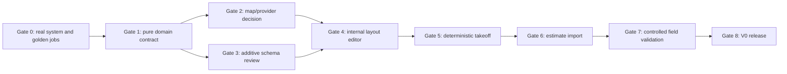

# Fence Mapping + Fence Engine V0 Implementation Plan

Status: planning and acceptance contract only

Repository: `mmckenz7/McKenzie-Construction`

Branch audited: `beta/estimating-core`

Plan date: 2026-08-10

Architecture dependency: `docs/FENCE_MAPPING_ENGINE_ARCHITECTURE.md`

Implementation status: no schema migration or production-code change in this plan has been applied

## Outcome

V0 will let an authenticated McKenzie estimator draw one fence layout on
satellite imagery, define explicit gates and fence-system transitions, generate
a deterministic and traceable physical takeoff for one approved real fence
system, and apply reviewed quantities to an existing structured draft estimate
through the existing pricing engine.

The first production implementation must not start until McKenzie supplies the
real installation rules and golden jobs in Gate 0 below. Repository inspection
found no existing fence-system rows, fence assemblies, fence catalog seed data,
or validated takeoff examples. Inventing those values would create false
material quantities.

A read-only check of configured staging project `iiofljulghibantfzlim` on
2026-08-10 found zero rows in both `material_catalog` and `labor_catalog`.
Production was not queried. Gate 0 therefore includes creation and approval of
the required canonical material/labor identities through the catalog track; it
cannot merely link Fence Engine rules to existing staging rows.

Work that can proceed before Gate 0 is limited to reviewed design artifacts,
provider spikes that do not persist production data, and provider-neutral
contract tests that use clearly identified test-only geometry.

## Fixed V0 boundary

### Included

- internal, authenticated estimator workflow;
- existing structured draft estimate as parent and import target;
- address confirmation and satellite imagery;
- drawing/editing fence nodes, runs, gates, and system transitions;
- versioned layout revisions with measurement source and verification state;
- segment, run, fence, gate-opening, and total-alignment lengths;
- one approved real McKenzie fence-system version;
- approved gate assemblies needed by the selected golden jobs;
- deterministic bay/panel, post, gate, concrete, hardware, material, and labor
  takeoff;
- full calculation trace and explicit blockers;
- reviewed, hash-bound import preview;
- one atomic, revision-fenced application into an existing draft estimate;
- existing estimate engine as the only price authority;
- feature gating, authorization, audit, and test coverage.

### Excluded

- GPS walk-the-line;
- parcel overlays;
- customer self-layout or public tokens;
- offline/native field capture;
- external GNSS, LiDAR, drone, or elevation-derived geometry;
- survey, legal-boundary, easement, setback, or utility-locate decisions;
- automatic imagery tracing or AI quantity generation;
- multiple fence families not required by the approved V0 golden jobs;
- arbitrary formulas or executable rule scripts;
- estimate options, proposals, contracts, supplier ordering, scheduling, or
  project activation from Fence Engine;
- schema or production code before the architecture and Gate 0 inputs are
  approved.

## Delivery gates



No gate can be waived by marking unknown inputs as zero, using nominal linear
footage, or substituting unreviewed catalog data.

### Gate 0 — McKenzie fence standard and golden jobs

Owner: McKenzie operations/estimating

Engineering activity: facilitate, validate completeness, and encode only after approval

Required inputs:

- exact V0 fence-system name and construction method;
- height and relevant post/panel/rail/picket/wire dimensions;
- nominal bay/panel width and maximum post spacing;
- minimum shortened bay/panel and cut/variable-width rules;
- remainder handling and deterministic tie-break preference;
- terminal, corner, line, transition, hinge, and latch post requirements;
- whether mixed systems share posts and under which conditions;
- footing shape, diameter, depth, and concrete policy by post role;
- rail/picket/wire/fastener/cap rules;
- slope modes supported in V0 and the conditions that must block;
- walk, single, double-drive, and/or custom gate assemblies needed by V0;
- gate clearances, leaf rules, hinge/latch/drop-rod/cane-bolt/hardware rules;
- explicit confirmation that double gates have no center post unless the
  selected assembly specifically requires one;
- demolition, waste, package-rounding, and labor rules used by McKenzie;
- real canonical material and labor catalog identities or an explicit catalog
  remediation list;
- at least the acceptance jobs specified below, hand-calculated independently;
- named operational approver and approval date.

Minimum golden-job set:

1. one straight run that is an exact bay multiple;
2. one straight run with a legal shortened/end bay;
3. one run that requires remainder distribution;
4. an inside or outside corner with correct corner-post treatment;
5. two connected runs where the endpoint post must not be double-counted;
6. one fence-system transition if transitions are included in V0;
7. one walk or single gate;
8. one double-drive gate proving hinge/latch posts, hardware, drop rod, and no
   default center post;
9. one footing/concrete case that exercises package rounding;
10. one unsupported condition that must block instead of calculating.

Each golden job must provide measured run/opening dimensions, a post-position
schedule, bay/panel widths, gate components, material quantities, labor
quantities, and an explanation of rounding. Customer names, addresses, and
prices are not needed and should be removed from fixtures.

Exit criteria:

- every required field is answered or explicitly outside V0;
- catalog gaps are listed without invented mappings;
- two reviewers agree on each expected takeoff;
- the rule packet and golden outputs receive stable version identifiers and a
  content hash.

### Gate 1 — Pure domain and engine contract

Owner: Fence Engine track

Deliverables:

- provider-neutral TypeScript domain schemas;
- integer dimension and rounding policy;
- topology validator contract;
- fence-system rule schema with no executable expressions;
- deterministic takeoff input/output and trace schemas;
- error/blocker vocabulary;
- canonical serialization and hashing rules;
- golden fixture format and test harness design.

Exit criteria:

- domain library imports no React, Next.js, Supabase, mapping SDK, or pricing
  module;
- identical normalized input produces identical serialized output;
- every generated quantity has a source object and rule path;
- unsupported/unknown inputs block;
- McKenzie golden jobs can be represented without hidden free-form behavior.

### Gate 2 — Map and geocoding provider decision

Owner: Fence Engine track with business/contract approval

Run two time-boxed internal spikes using the same geometry interaction
controller:

- Mapbox GL JS with Mapbox geocoding and satellite imagery;
- MapLibre GL JS with one explicitly licensed imagery/geocoding combination.

Do not use the removed Google Maps Drawing Library as a comparison baseline.
Google or ArcGIS can be reconsidered only if they offer a material advantage on
the actual target workflow.

Evaluation set:

- a small list of McKenzie-authorized target addresses representing urban,
  suburban, wooded, and large-lot conditions;
- address selection accuracy;
- imagery resolution, age/vintage visibility, alignment, and target-area
  coverage;
- touch and mouse drawing/editing;
- custom node/gate/transition interactions;
- attribution and export/screenshot requirements;
- geocoding-result retention rights;
- browser token restriction and quota controls;
- projected map load, geocode, and imagery cost;
- provider outage/error behavior;
- future customer-facing licensing.

Exit criteria:

- completed evidence matrix, contract/terms sign-off, and selected provider;
- adapter boundary demonstrated without provider objects in saved domain data;
- no production credentials or customer geometry committed to the repository.

### Gate 3 — Additive schema and authorization review

Owner: Fence Engine track with database/security review

Design the first additive migration only after Gate 1 stabilizes. It should
cover:

- layout and immutable revision identity;
- normalized nodes, runs, vertices, and gate openings;
- measurement observations and append-only corrections;
- immutable fence-system versions and catalog component mappings;
- takeoff revisions, items, and trace;
- estimate application and mapping records;
- feature flag and dedicated permissions;
- server-only grants, indexes, constraints, and audit triggers.

Before writing DDL:

- resolve the tenant/company ownership root;
- audit staging and production table/constraint/grant state read-only;
- decide whether PostGIS is needed; V0 must not depend on it by accident;
- define retention and deletion policy for exact location and future media;
- coordinate structured line-item catalog persistence with estimating core;
- coordinate canonical product/unit mapping with the material catalog track.

Exit criteria:

- migration is additive, transactional where possible, and fails closed against
  audited prerequisites;
- no production execution is included in approval of the file itself;
- cross-estimate references are impossible;
- revisions/observations cannot be silently overwritten;
- authenticated/anon cannot access server-only fence tables directly;
- authorization and schema contract tests are specified before deployment.

### Gate 4 — Internal layout editor

Owner: Fence Engine track

Deliverables:

- estimator-only route linked from an existing draft estimate;
- confirmed address and satellite map;
- add/move/insert/delete nodes and vertices;
- create/split/delete/reorder runs;
- add/edit/remove explicit gate openings;
- add/edit fence-system transitions;
- undo/redo and unsaved-change protection;
- source/verification labeling and estimating/not-a-survey warning;
- normalized length display from the domain geometry service;
- save as a new immutable layout revision;
- revision diff/read view.

Exit criteria:

- no editing action writes price or estimate items;
- gate span cannot also be installed-fence span;
- run endpoints match nodes and invalid topology cannot be approved;
- browser/map pixels are never the length authority;
- keyboard, mouse, and touch paths are tested;
- public/customer access is impossible.

### Gate 5 — Deterministic takeoff

Owner: Fence Engine track with operational review

Deliverables:

- approved-rule loader and hash verification;
- bay/panel candidate generation and deterministic selection;
- line/node post resolver and post-instance schedule;
- gate assembly expansion;
- concrete, hardware, core materials, waste, package, and labor expansion;
- traceable normalized output;
- blocker/warning review screen;
- immutable takeoff revision and approval event.

Exit criteria:

- all Gate 0 golden jobs pass exactly;
- invariants and property-based tests pass;
- double-gate center-post default is tested as absent;
- every output item links to geometry, rule, and catalog identity;
- unresolved catalog item, unknown rule, invalid topology, or unsupported
  condition blocks approval;
- no unit cost, markup, overhead, tax, discount, profit, or customer price is
  calculated by Fence Engine.

### Gate 6 — Existing estimate import

Owner: Fence Engine and estimating-core tracks jointly

Deliverables:

- import preview with exact create/update mapping;
- current catalog/price resolution through approved estimating/catalog paths;
- dedicated server-authorized atomic transaction/RPC;
- draft-status, expected revision, takeoff hash, and idempotency checks;
- one complete estimate recalculation through existing calculation code;
- application mapping and post-import projection;
- safe retry and stale-state UI.

Exit criteria:

- partial import is impossible;
- stale estimate or takeoff state changes no data;
- unknown costs remain null, while known non-applicable costs are explicit
  zeroes;
- calculation bundle correspondence is verified;
- existing material tax and estimate pricing tests remain authoritative;
- imported items remain reviewable in the normal estimate builder;
- proposal, contract, lead lifecycle, and project activation are unchanged.

### Gate 7 — Controlled field validation

Owner: McKenzie estimator/operations with Fence Engine support

Use completed historical or controlled non-customer-identifying layouts to
compare:

- drawn aerial lengths versus tape/laser verified dimensions;
- V0 post/panel/gate schedule versus independent hand takeoff;
- imported estimate quantities versus approved takeoff;
- time to produce and review a layout;
- correction frequency and causes;
- imagery/provider failures and usability issues.

This is not GPS validation. Browser GPS remains outside V0.

Exit criteria:

- no unresolved critical quantity mismatch;
- every mismatch has a documented geometry, rule, catalog, import, or human
  cause;
- agreed tolerance and escalation guidance is visible to estimators;
- operational approver accepts the release evidence.

### Gate 8 — V0 release

Owner: product/operations/security

Release requirements:

- default-off feature flag and controlled role rollout;
- production-readiness and rollback plan;
- provider quotas/alerts and key restrictions;
- monitoring for calculation blockers, import failures, and provider errors;
- support playbook and ownership;
- user training on estimating versus survey/legal boundaries;
- no production modification without exact approval required by repository
  policy.

## Proposed domain contract

The following is design-level pseudocode, not production code or a source of
installation values.

### Stable identifiers and integers

```ts
type Millimeters = bigint;
type QuantityUnits = bigint;
type DecimalDegrees = string;
type DomainId = string;
type ContentHash = string;
```

All saved longitude/latitude values use normalized decimal strings. All
authoritative construction dimensions use integer millimeters. Any conversion
to estimate decimal quantities occurs only at the import boundary with a pinned
rounding rule.

### Measurement provenance

```ts
type MeasurementSource =
  | "aerial_map"
  | "customer_drawn"
  | "gps"
  | "parcel"
  | "manual"
  | "laser"
  | "derived";

type VerificationState =
  | "preliminary"
  | "estimated"
  | "field_verified"
  | "manually_corrected";

type MeasurementRef = {
  source: MeasurementSource;
  verification: VerificationState;
  observationId: DomainId | null;
  correctionId: DomainId | null;
};
```

### Geometry input

```ts
type FenceNodeKind =
  | "start"
  | "end"
  | "corner"
  | "terminal"
  | "gate_start"
  | "gate_end"
  | "fence_transition"
  | "grade_break"
  | "custom";

type NormalizedCoordinate = {
  longitude: DecimalDegrees;
  latitude: DecimalDegrees;
};

type FenceNodeInput = {
  id: DomainId;
  kind: FenceNodeKind;
  coordinate: NormalizedCoordinate;
  measurement: MeasurementRef;
};

type FenceRunInput = {
  id: DomainId;
  fromNodeId: DomainId;
  toNodeId: DomainId;
  vertices: readonly NormalizedCoordinate[];
  fenceSystemVersionId: DomainId;
  manualLengthMm: Millimeters | null;
  measurement: MeasurementRef;
};
```

`vertices` includes the endpoint coordinates in stable order. A manual/laser
length may supersede derived geometry only with an observation/correction and
review reason. It does not fabricate coordinates.

### Gate input

```ts
type GateKind = "walk_gate" | "single_gate" | "double_drive_gate" | "custom";

type FenceOpeningInput = {
  id: DomainId;
  startNodeId: DomainId;
  endNodeId: DomainId;
  clearWidthMm: Millimeters;
  gateKind: GateKind;
  gateAssemblyVersionId: DomainId;
  measurement: MeasurementRef;
};
```

The gate assembly version supplies leaf, post, footing, clearance, and hardware
rules. The opening does not accept arbitrary material lines.

### Rule input

```ts
type FenceSystemRuleInput = {
  systemVersionId: DomainId;
  schemaVersion: "fence-system-rules-v1";
  contentHash: ContentHash;
  status: "approved";
  dimensions: Readonly<Record<string, Millimeters>>;
  bayPolicy: Readonly<Record<string, unknown>>;
  postPolicy: Readonly<Record<string, unknown>>;
  footingPolicy: Readonly<Record<string, unknown>>;
  componentMappings: readonly ComponentMapping[];
};
```

The production schema must replace broad `Record` placeholders with exact
discriminated unions after Gate 0. They appear here only to show contract
boundaries, not to authorize free-form rule execution.

### Takeoff result

```ts
type TakeoffBlockerCode =
  | "invalid_topology"
  | "unknown_measurement"
  | "verification_required"
  | "unapproved_system_version"
  | "unsupported_remainder"
  | "shortened_bay_below_minimum"
  | "unsupported_transition"
  | "unsupported_slope"
  | "unsupported_gate"
  | "missing_component_mapping"
  | "unit_conversion_missing";

type TakeoffTrace = {
  sourceType: "run" | "node" | "opening" | "post_instance" | "layout";
  sourceId: DomainId;
  rulePath: string;
  formulaId: string;
  rawQuantity: string;
  roundedQuantity: string;
  unit: string;
};

type TakeoffItem = {
  componentKey: string;
  materialCatalogId: DomainId | null;
  laborCatalogId: DomainId | null;
  quantity: string;
  unit: string;
  trace: readonly TakeoffTrace[];
};

type FenceTakeoffResult = {
  policyVersion: string;
  layoutRevisionHash: ContentHash;
  ruleHashes: readonly ContentHash[];
  blockers: readonly TakeoffBlockerCode[];
  warnings: readonly string[];
  items: readonly TakeoffItem[];
  resultHash: ContentHash;
};
```

Warnings are non-authoritative display text backed by stable warning codes in
the production contract. A non-empty blocker collection makes the result
non-importable.

## Planned module boundaries

Proposed paths are illustrative and should be checked against concurrent work
before creation.

```text
src/lib/fence-engine/
├── domain-types.ts
├── integer-dimensions.ts
├── normalize-geometry.ts
├── geodesic-length.ts
├── validate-topology.ts
├── validate-rules.ts
├── layout-bays.ts
├── resolve-posts.ts
├── expand-gates.ts
├── expand-components.ts
├── aggregate-takeoff.ts
├── canonicalize.ts
└── index.ts
```

Keep provider and application integration outside that directory:

```text
src/lib/fence-mapping/       map/geocoder adapters and interaction controller
src/lib/fence-persistence/   server-only database projections and authorization
src/lib/fence-import/        server-only estimate import preview/application
src/components/fence/        UI only
```

The pure engine may consume types from a small shared schema package. It must
not import the estimate calculation engine because takeoff has no price
authority. The import layer—not Fence Engine—calls existing estimate
calculation/persistence services.

## Planned API surface

Names are proposals, not authorization to implement before schema review.

| Method/path | Purpose | Key protection |
| --- | --- | --- |
| `POST /api/estimates/[estimateId]/fence-layouts` | Deliberately start an internal layout. | Estimate relationship, feature, and edit permission. |
| `GET /api/fence-layouts/[layoutId]` | Read current layout/revisions. | Server authorization and cost-safe projection. |
| `POST /api/fence-layouts/[layoutId]/revisions` | Save a new immutable normalized revision. | Expected prior revision and topology validation. |
| `POST /api/fence-layouts/[layoutId]/takeoffs` | Generate immutable deterministic takeoff. | Approved rules, exact layout hash, idempotency. |
| `POST /api/fence-takeoffs/[takeoffId]/review` | Record explicit approval/rejection. | Authorized actor and unchanged hash. |
| `POST /api/fence-takeoffs/[takeoffId]/import-preview` | Resolve intended estimate/catalog mapping. | Draft estimate and cost permission. No mutation. |
| `POST /api/fence-takeoffs/[takeoffId]/apply` | Atomically apply approved preview. | Expected estimate revision, preview hash, idempotency. |

Do not create a generic unauthenticated geometry API in V0.

## Estimate import coordination contract

The fence and estimating tracks must agree on these items before Gate 6:

1. Whether structured estimate items will persist `material_catalog_id` and
   `labor_catalog_id` canonically. Current structured mutation output sets both
   to null.
2. Whether one takeoff item maps to one estimate item or whether approved
   aggregation is allowed by catalog/unit/component key.
3. How catalog unit conversion is resolved and versioned.
4. Which source supplies current material/labor unit costs.
5. How physical takeoff waste differs from estimate pricing waste so it is not
   applied twice.
6. How imported items are replaced on re-application without deleting
   unrelated estimator-authored items.
7. Which estimate section structure and customer descriptions are approved.
8. How the import transaction calls the same calculation and persistence
   contract as normal estimate mutations.

Recommended replacement rule:

- every application owns only the canonical items it created;
- a later application presents an explicit diff;
- after approval, the transaction replaces/supersedes only those mapped items;
- it never deletes or rewrites unrelated manual estimate items;
- a sent, accepted, expired, converted, or otherwise non-draft estimate cannot
  receive a re-application.

## Authorization matrix

The exact permission names require role-policy review.

| Action | Suggested permission | Additional requirement |
| --- | --- | --- |
| View layout | Sales estimate access | Access to linked estimate. |
| Edit map geometry | `edit_fence_layouts` | Draft layout and internal feature enabled. |
| Approve field/manual correction | `verify_fence_measurements` | Actor/reason audit. |
| Manage fence-system versions | `manage_fence_systems` | Separate operational approver. |
| Generate takeoff | `edit_fence_layouts` | Approved rules and valid revision. |
| Approve takeoff | `approve_fence_takeoffs` | Cannot approve changed hash. |
| View resolved costs | Existing `view_costs` | Fence takeoff itself remains price-free. |
| Apply to estimate | `apply_fence_takeoffs` plus existing `edit_prices` | Draft estimate, approved preview, expected revision. |

Owner/administrator should not bypass object consistency, immutable history, or
draft/hash/revision guards.

## Acceptance test matrix

### Geometry

- address/map provider selection does not change saved normalized geometry;
- inserting, moving, and deleting vertices updates derived segments exactly;
- manual/laser override retains derived length and correction evidence;
- run endpoint coordinates equal referenced node coordinates;
- zero-length, duplicate, disconnected, or self-referencing runs block;
- gate opening cannot overlap installed run geometry;
- transition divides system assignments intentionally;
- canonical serialization is stable regardless of object insertion order.

### Bay and post layout

- exact multiple;
- legal and illegal shortened bay;
- distributed remainder with integer-millimeter sum preservation;
- no-cut manufactured panel failure;
- maximum spacing never exceeded;
- shared run endpoint post counted once;
- corner/terminal/gate precedence;
- incompatible transition produces configured multiple post instances;
- reversal follows documented symmetric/asymmetric tie-break rules.

### Gates

- walk/single/double/custom only when approved for V0;
- hinge/latch post types and footing overrides;
- leaf widths sum to the configured opening/clearance contract;
- hardware set is complete and not duplicated;
- double gate has no center post unless the selected approved assembly says so;
- unsupported width, grade, swing, or automation blocks.

### Materials and labor

- every component resolves to an approved catalog identity;
- concrete volume and package rounding follow the approved aggregation point;
- fastener/rail/wire/panel package rounding occurs exactly once;
- physical waste and estimate pricing waste are not double-applied;
- labor units follow approved production rules;
- aggregation preserves all trace quantities.

### Import

- preview is read-only and hash-stable;
- stale estimate revision returns a conflict and writes nothing;
- changed layout/rules/takeoff/review invalidates preview;
- retry with the same idempotency key does not duplicate sections/items;
- transaction failure leaves the estimate unchanged;
- unknown cost remains unknown rather than zero;
- one existing estimate calculation pass produces the persisted totals;
- customer proposal output remains governed by existing presentation code.

### Authorization and privacy

- unauthenticated, non-Sales, and unrelated-object access fails;
- role without edit permission can read only the allowed projection;
- rule management and takeoff approval are separately enforced;
- direct table access is unavailable to anon/authenticated roles;
- exact geometry and internal traces do not appear in public proposal responses,
  activities, logs, or errors.

## Rollout and observability

### Rollout stages

1. local pure-engine golden tests;
2. local/staging schema and authorization tests;
3. internal feature-disabled deployment;
4. owner/estimator pilot on controlled layouts;
5. limited production enablement for named roles after exact approval;
6. broader internal enablement only after mismatch review.

### Required operational signals

- layout revision creation success/failure;
- topology blocker counts by stable code;
- takeoff generation duration and blocker counts;
- rule/catalog mapping failures;
- import preview and apply outcomes;
- stale revision/hash conflicts;
- map/geocode provider errors, latency, and quota consumption;
- human corrections by source and reason;
- post-import quantity mismatch reports.

Logs use IDs and stable codes, not raw coordinates, addresses, notes, photos,
voice content, prices, or provider secrets.

## Risk register

| Risk | Impact | Control |
| --- | --- | --- |
| Unverified fence rules | Incorrect order quantities. | Gate 0 approval and independently calculated golden jobs. |
| Imagery/parcel misalignment | Fence drawn in the wrong location. | Persistent disclaimer, source labels, field/manual verification, no parcel auto-conversion. |
| Floating-point/rounding drift | Non-repeatable panels or material packs. | Integer millimeters, versioned geodesic/rounding, canonical hashes. |
| Gate treated as LF deduction | Missing posts/hardware/concrete. | Explicit opening and assembly model with golden gate cases. |
| Endpoint post duplication | Material overcount. | Node-owned demand resolution and post-instance trace. |
| Rule/catalog coupling to supplier SKU | Fragile or wrong substitutions. | Canonical product mappings before supplier offers. |
| Waste applied twice | Inflated material/cost. | Separate physical and pricing waste contracts with import test. |
| Partial estimate import | Corrupt/inconsistent estimate. | One idempotent revision-fenced transaction. |
| Parallel estimating/catalog changes | Contract collision. | Joint Gate 3/Gate 6 review; inspect current tree before editing. |
| Provider licensing/storage violation | Legal/service interruption. | Terms review, adapter storage mode, attribution, scoped credentials. |
| Tenant ambiguity | Cross-company exposure. | Resolve tenant root before schema/public access. |
| Scope expansion into GPS/parcel/customer flows | Delayed/unvalidated V0. | Fixed exclusion list and separate post-V0 gates. |

## Definition of ready for implementation

Implementation is ready to begin only when:

- architecture and this V0 plan are approved;
- Gate 0 rule packet and golden jobs are complete;
- one operational approver is named;
- concurrent estimating and catalog owners agree on integration boundaries;
- provider spike/contract work is authorized;
- tenant and sensitive-location retention decisions have owners;
- no overlapping uncommitted file changes exist in the intended module paths.

## Immediate next actions

### McKenzie operations

Complete Gate 0 using actual installation standards and catalog identities.
The highest-value first decision is the exact V0 fence system and the gate
assemblies needed by its golden jobs.

### Fence Engine track

After Gate 0 approval:

1. replace the design-level `Record` placeholders with exact discriminated rule
   types;
2. write the engine input/output JSON schemas and canonical hash specification;
3. encode the approved golden jobs as test-only fixtures;
4. implement the pure deterministic engine in isolation;
5. run the provider comparison without production persistence;
6. return for additive schema approval before database or UI implementation.

### Estimating and catalog tracks

Resolve persistent structured line-item catalog links, canonical units, price
resolution, physical-versus-pricing waste, and the atomic bulk-import contract.

Until those inputs and approvals exist, the correct status is **designed and
ready for business-rule intake**, not partially implemented with nominal or
fake fence data.
