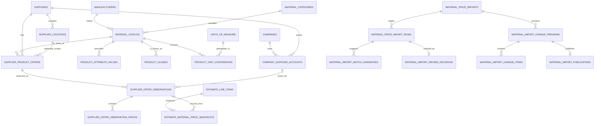

# Universal Material Catalog + Supplier Pricing Architecture

Status: architecture proposal only

Repository: `mmckenz7/McKenzie-Construction`

Branch audited: `beta/estimating-core`

Audit date: 2026-08-10

Implementation status: no schema, API, estimating, purchasing, or production workflow change in this pass

## Executive recommendation

Keep one McKenzie OS identity for each physically distinct, purchasable product,
and separate that identity from every supplier's way of selling and pricing it.

The target separation is:

```text
canonical physical product
  -> product-specific units and conversions
  -> supplier product offer / SKU mapping
  -> immutable price and availability observations
  -> explicit price selection
  -> immutable estimate price basis
  -> future purchase-order line
```

Do not make a supplier SKU the product key. Do not store the current supplier
price on the canonical product. Do not update a price observation in place. Do
not let an import publish anything until a human has reviewed ambiguous product
matches and a price-change preview.

The current repository already has a useful foundation. Retain the existing
`material_catalog` IDs and the supplier, supplier-location, estimate-line, and
estimate-snapshot relationships. Evolve `material_catalog` into the canonical
physical-product master. Split the mixed responsibilities in
`material_supplier_prices` into a stable supplier-product offer and append-only
observations. Extend the existing import header with row-level staging,
matching, review, preview, and publication records.

The smallest useful V0 is deliberately narrow: CSV/XLSX ingestion for one
supplier, deterministic column and unit normalization, exact SKU matching plus
a review queue, append-only published price history, supplier comparison, and
an explicit action that copies a chosen price and its basis into a draft
estimate. It does not include supplier API credentials, automatic estimate
repricing, purchase-order issuance, or material optimization.

## Non-negotiable invariants

1. A canonical product represents one physically distinct purchasable item,
   independent of supplier.
2. Supplier SKUs belong to supplier offers, never to canonical identity.
3. A price observation is append-only evidence. A newer observation supersedes
   it for selection purposes but does not rewrite it.
4. Imports stage first and publish only through an explicit, authorized action.
5. Ambiguous and unmatched rows cannot create canonical products automatically.
6. Unit conversion is dimensional, product-aware, versioned, and auditable.
7. Pricing selection and estimate calculation are separate operations.
8. An estimate stores the selected numeric cost and a self-contained pricing
   basis. Later catalog changes cannot alter either one.
9. Issued estimates, proposal snapshots, contract-preparation snapshots, and
   contract values never reprice from the catalog.
10. Supplier account prices and raw import files are company-confidential.

## Repository audit

### Existing price-book and material entities

| Entity or code | Current responsibility | Current use and limitation |
| --- | --- | --- |
| `material_catalog` | Material description, optional SKU, category, brand, product line, unit, mutable `unit_cost`, waste default, and legacy supplier text fields. | Used by the material pages/API. It mixes canonical identity with a fallback price and legacy supplier ownership. It has no normalized manufacturer, variant attributes, aliases, dimensions, or uniqueness contract. |
| `suppliers` | Supplier identity, type, account number, capability flags, and metadata. | Useful identity foundation, but `account_number` is company-specific and should not live on a shared supplier identity. `slug` is globally unique. |
| `supplier_locations` | Store/branch contact and address information. | Useful and should be retained. It needs tenant-aware access and stable external-location identifiers for APIs. |
| `material_supplier_prices` | Canonical-product link, supplier/location, supplier and manufacturer SKUs, unit, one cost, availability, minimum order, delivery fields, price type, dates, source, confidence, and active flag. | Conflates stable product mapping, package/sell unit, price history, and inventory. The CSV route updates a matching row in place, so history is lost. There is no uniqueness constraint protecting supplier SKU mappings. |
| `material_price_imports` | Import header, source file fields, row counts, status, extraction JSON, and errors. | Good batch/audit starting point, but there are no durable staged rows, column maps, match candidates, review decisions, or publish transaction. |
| `procurement_settings` | Default supplier-selection strategy, preferred/Lowes fallback locations, freshness and discrepancy thresholds. | Useful policy concepts. It is a global single-row model and has Lowes-specific fields that should become generic fallback policy rows before multi-company use. |
| `project_procurement_settings` | Project-specific selection strategy and preferred supplier/location. | Retain as a future source of pricing-selection policy. Do not activate it for automatic ordering in this track. |
| `estimate_line_items` | Estimate quantity/unit plus material and other component costs and calculated outputs. | Structured items persist their own numeric cost inputs. The current structured mutation path deliberately writes `material_catalog_id = null`; catalog selection is not yet integrated. |
| `estimate_material_price_snapshots` | Material, supplier/location, SKU, quantity/unit, cost, source, timestamps, override, confidence, and metadata evidence for an estimate. | Strong concept to retain and extend. It is not populated by current structured estimate mutations, is not append-only, and does not identify a stable supplier offer, observation, conversion, or selection policy. |
| proposal and contract-preparation snapshots | Frozen customer-facing estimate/contract preparation data. | Preserve unchanged. These are downstream commercial snapshots, not live catalog views. |
| `project_material_phases` | Delivery readiness/status at a project phase level. | Future PO and fulfillment integration point; currently contains supplier name as text and no line-level ordered material. |
| `subcontractor_material_review_items` | Project material-review quantities with an optional `material_catalog_id`. | Retain the canonical product link for future fulfillment review. |
| `project_costs` | Actual project expenses by category and vendor text. | Future actual-versus-estimated reconciliation target; presently not product-, quantity-, offer-, or PO-line-specific. |
| `/api/material-catalog` | Catalog CRUD, price selection, and synchronous CSV import. | Any active employee can reach a service-role-backed route. Import auto-creates products and updates current price rows before review. Selection compares raw `unit_cost` without converting units or incorporating order multiples/delivery. |
| `/api/suppliers` and `/api/procurement-settings` | Supplier/settings management. | Authenticates an active employee but does not enforce the existing `manage_suppliers`/`edit_prices` permission concepts. |

### Existing behavior that must be retained

- Canonical material IDs already referenced by estimate snapshots,
  subcontractor material reviews, and legacy estimate lines.
- Supplier and supplier-location identities and their project/company preference
  links.
- Existing structured estimate calculation code, fixed-point decimal handling,
  optimistic revision fencing, draft-only mutation boundary, and separate
  component costs.
- Existing estimate numeric fields as the calculation inputs of record.
- Existing proposal and contract-preparation snapshots.
- Existing material waste defaults as company estimating policy, though they
  should move out of universal physical identity when multi-company settings
  are introduced.
- Import provenance fields, confidence vocabulary, source references,
  effective/expiration dates, freshness settings, and discrepancy thresholds.
- The user-facing ability to compare suppliers and fall back to a manually
  entered cost when no approved supplier price is available.

### Responsibilities to replace or extend

| Current design | Recommendation |
| --- | --- |
| `material_catalog.sku` | Treat as a deprecated legacy identifier. Add an immutable McKenzie product code and normalized manufacturer part number. Supplier SKUs move exclusively to supplier offers. |
| `material_catalog.unit_cost` | Keep temporarily as a compatibility fallback, stop updating it from imports, and deprecate after all consumers use explicit price selection. |
| `material_catalog.supplier_name` / `supplier_item_number` | Deprecate and backfill into supplier and supplier-offer records. Never populate for new canonical products. |
| `material_catalog.waste_percent` | Retain for compatibility. Long term, move company/trade-specific estimating waste into `company_product_settings` or calculation assemblies because waste is policy, not product identity. |
| `material_supplier_prices` | Replace its write path with `supplier_product_offers` plus immutable `supplier_offer_observations` and child price amounts. Keep a compatibility view or dual-read adapter during migration. |
| `material_price_imports.extraction_data` | Keep only batch-level diagnostics. Add normalized row tables instead of hiding workflow state in JSON. |
| synchronous CSV loop | Replace with staged, idempotent processing. V0 may execute in a bounded request for small files, but it must still persist stages and publish atomically. Larger files and APIs use a worker/queue. |
| hard-coded column synonyms | Retain as starter heuristics behind versioned supplier import profiles and an editable detected-column map. |
| raw lowest-price selection | Replace with normalized landed-cost comparison: same target unit, eligible price type/account/location, effective/fresh, purchasable order quantity, then delivery/fees. |
| Lowes-specific fallback columns | Preserve until a generic ordered supplier-selection policy is introduced; do not add more vendor-specific columns. |

## Target domain model

Names below are proposals. The first migration should be additive and separately
reviewed. Existing tables should not be renamed in the first release.

### Canonical product identity

`material_catalog` remains the canonical product table during the transition.
Each row represents one purchasable physical variant, not a family and not a
supplier listing.

Recommended additive fields:

- `mckenzie_product_code`: stable, non-semantic, unique human-readable code;
- `manufacturer_id`: link to `manufacturers`;
- `manufacturer_part_number`: normalized MPN when one exists;
- `product_line_id`: optional link to `manufacturer_product_lines`;
- `category_id`: link to hierarchical `material_categories`;
- `canonical_name`: human-readable variant name;
- `stocking_unit_id`: the product's canonical comparison/inventory unit;
- `lifecycle_status`: `draft`, `active`, `discontinued`, `superseded`, or
  `archived`;
- `superseded_by_product_id`: explicit merge/replacement destination;
- `identity_fingerprint`: normalized duplicate-detection key;
- `identity_version`: version of the fingerprint/attribute policy;
- audit fields for creator, reviewer, review time, and source.

Use normalized supporting entities:

- `manufacturers(id, canonical_name, normalized_name, website_url, status)`;
- `manufacturer_product_lines(id, manufacturer_id, name, normalized_name)`;
- `material_categories(id, parent_id, code, name, trade_code, status)`;
- `product_attribute_definitions(id, category_id, code, label, value_type,
  dimension, identity_weight, required_for_identity)`;
- `product_attribute_values(product_id, definition_id, text_value,
  numeric_value, boolean_value, unit_id, normalized_value)`;
- `product_dimensions(product_id, dimension_type, nominal_value,
  actual_value, unit_id)` where dimensions deserve range and conversion logic.

The typed attribute design supports decking color and profile, lumber species
and grade, fastener gauge/head/coating, fencing style, concrete mix strength,
railing system/color, hardware finish, steel shape/grade, roofing exposure, and
siding profile without adding a Trex-specific column set.

Example canonical product:

```text
manufacturer: Trex
product line: Enhance Naturals
category: Composite Decking
canonical name: Enhance Naturals Rocky Harbor Grooved 1x6x16
manufacturer part number: <manufacturer value>
stocking unit: each
attributes:
  color = Rocky Harbor
  profile = grooved edge
  nominal width = 6 in
  nominal thickness = 1 in
  length = 16 ft
```

The exact 16-foot, Rocky Harbor, grooved board is one canonical product. A
12-foot board, square-edge board, or different color is a different physical
product. They may share a product family, but never an ID.

### Product aliases

Add `product_aliases` with:

- `product_id`, alias text, normalized alias text, language;
- alias type: `common_name`, `legacy_sku`, `manufacturer_marketing`,
  `abbreviation`, `misspelling`, or `internal_name`;
- optional company scope;
- source and verification fields;
- active/effective dates.

Aliases improve search and matching but never define price or supplier SKU.
Supplier descriptions can be retained on the supplier offer and as matching
evidence without becoming approved global aliases automatically.

### Supplier identity, accounts, and locations

Retain `suppliers` as the supplier organization and `supplier_locations` as a
physical or fulfillment location. Add stable external keys only when provided
by the supplier.

Move company-confidential relationship data to
`company_supplier_accounts`:

- `company_id`, `supplier_id`, account nickname and masked account reference;
- contract/customer group identifiers safe to store in the database;
- default currency, payment and delivery terms;
- active/effective dates and status;
- credential reference ID, never an API secret itself.

One supplier can therefore serve many companies without sharing negotiated
prices or account numbers. A company can have multiple accounts with one
supplier when divisions or terms differ.

### Supplier-product mapping

Add `supplier_product_offers` as the stable mapping between a supplier listing
and a canonical product:

- `id`, `supplier_id`, optional `supplier_location_id` when the listing truly
  exists only at one location;
- `material_catalog_id`;
- `supplier_sku`, normalized supplier SKU, supplier description;
- optional supplier manufacturer name/MPN as received;
- `sell_unit_id` and `product_unit_conversion_id`;
- minimum order, order increment, and package barcode/UPC/GTIN when known;
- status: `active`, `temporarily_unavailable`, `discontinued`, `replaced`, or
  `unverified`;
- effective dates, source, verification, and audit fields.

Required uniqueness rules:

- one active mapping for `(supplier, location-scope, normalized supplier SKU)`;
- a supplier SKU cannot map to two active canonical products in the same
  location scope;
- multiple supplier SKUs may map to one canonical product;
- remapping requires a reviewed decision and audit record, never an overwrite
  that erases the prior mapping.

Add `supplier_product_mapping_history` or use effective-dated offer revisions
to record approved remaps, merges, and replacements.

### Pricing and availability history

Add append-only `supplier_offer_observations`. One row is a sourced observation
of an offer at an account/location/time:

- `supplier_product_offer_id`;
- nullable `company_supplier_account_id` for public pricing, required for
  negotiated pricing;
- nullable `supplier_location_id`;
- `observed_at`, `effective_from`, `effective_to`, `expires_at`;
- availability status: `in_stock`, `limited`, `backorder`, `special_order`,
  `discontinued`, `unknown`;
- inventory quantity and inventory unit when supplied;
- lead-time minimum/maximum plus unit;
- delivery cost, delivery minimum, delivery scope, and terms;
- source type, source record ID, import row/API run, raw-record hash;
- confidence/verification state and publishing actor/time.

Store monetary choices in `supplier_offer_observation_prices`:

- `observation_id`;
- `price_type`: `list`, `retail`, `contractor`, `negotiated`, `quoted`,
  `promotional`, `net_cost`, or `other`;
- amount and ISO currency;
- quantity represented and unit ID;
- quantity-break lower/upper bound;
- tax inclusion and promotion/terms notes when known.

This child table supports a feed row containing both list and contractor prices
without null-heavy columns or duplicate inventory observations. It also makes
company-specific negotiated prices explicit.

No `UPDATE` or `DELETE` should be available to normal application roles on a
published observation. Corrections append a replacement observation referencing
the erroneous one. A derived `current_supplier_offer_prices` view selects the
latest eligible, effective, non-superseded observation; the view is never the
historical source of truth.

## Unit and package normalization

### Unit dictionary

Add `units_of_measure` with stable codes, names, dimension, and precision:

- count: `EA`, `PAIR`, `SET`;
- length: `IN`, `FT`, `LF`;
- area: `SQ_IN`, `SQ_FT`, `SF`, `SQ` (roofing square = 100 square feet);
- volume: `CU_FT`, `CU_YD`, `GAL`;
- mass: `LB`, `TON`;
- packaging/order units: `PACK`, `BOX`, `BAG`, `BUNDLE`, `PALLET`, `ROLL`.

Alias spellings such as `ea`, `each`, `pc`, `pcs`, `linear ft`, and `sqft`
belong in `unit_aliases`. A normalized code is selected during import, but the
raw text remains on the staged row.

Only fixed same-dimension conversions belong in a global conversion table.
Use exact rational numerator/denominator values rather than floating-point
factors.

### Product-specific conversions

Pack, coverage, and cross-dimension conversions are product facts. Add
`product_unit_conversions`:

- `product_id`, `from_unit_id`, `to_unit_id`;
- exact `from_quantity` and `to_quantity` numerics;
- conversion kind: `package_contents`, `length_per_each`, `coverage_per_each`,
  `coverage_per_package`, `weight_per_each`, or `yield`;
- effective dates, source, verification, and rounding rule;
- `order_increment` and `rounding_mode` where relevant.

Examples:

```text
1 each 16-foot deck board = 16 LF
1 bundle of a specific board = 48 each
1 roofing bundle of a specific shingle = 33.33 SF of stated coverage
1 concrete bag of a specific mix/weight = its documented yield in CU_FT
```

Do not define a universal `1 each = N SF` or `1 bundle = N each`; those values
depend on the exact product. Nominal dimensions must not silently substitute
for documented coverage. Every price comparison records the conversion path,
conversion version, pre-round quantity, purchase quantity after rounding, and
effective cost per target unit.

### Comparison and landed cost

For requested quantity `Q` in target unit:

1. convert `Q` to the supplier sell unit using an approved conversion path;
2. round up to minimum order and order increment;
3. select the eligible price tier/account/location/effective date;
4. calculate merchandise cost with fixed-point decimals;
5. add applicable delivery and known fees without inventing missing values;
6. report leftovers and effective landed cost per target unit.

Unknown delivery or tax is shown as unknown, not zero. A comparison may rank by
merchandise cost only if it labels that basis and does not claim landed cost.

## Import architecture

### Supported inputs

- CSV with encoding and delimiter detection;
- XLSX/XLS as Excel-compatible input, selecting a worksheet and header row;
- later: supplier API, supplier quote, email attachment, PDF, or manual entry
  through the same normalized staging contract.

Never execute spreadsheet formulas or macros. Parse values in a sandboxed
worker with size, row, column, sheet, formula, and decompression limits. Store
the original file in private object storage with a checksum and retention
policy; never expose a permanent public URL.

### Durable workflow

```text
upload
  -> validate and fingerprint file
  -> detect sheet/header/delimiter and columns
  -> user confirms column mapping and import profile
  -> parse durable staged rows
  -> normalize identifiers, money, dates, and units
  -> find exact and fuzzy product candidates
  -> human reviews ambiguous/unmatched/conflicting rows
  -> build price/unit/mapping change preview
  -> authorized approval
  -> atomic, idempotent publish
  -> current-price projection refresh
```

Add or extend these entities:

- `material_price_imports`: batch state, company, supplier/account/location,
  file metadata/hash, parser/profile version, counts, and approval/publication
  audit;
- `supplier_import_profiles`: versioned saved sheet/header/column maps,
  date/decimal conventions, unit aliases, and supplier-specific transforms;
- `material_price_import_rows`: raw row JSON, raw line/sheet locator, normalized
  fields, deterministic row hash, validation errors, workflow status;
- `material_import_match_candidates`: product/offer candidate, component scores,
  explanation, algorithm version, and rank;
- `material_import_review_decisions`: reviewer decision, chosen product/offer,
  create-product request, ignore reason, notes, and timestamps;
- `material_import_change_previews`: immutable preview version and summarized
  counts/totals;
- `material_import_change_items`: per-row before/after mapping, unit, price,
  availability, effective-date, and percentage/absolute delta;
- `material_import_publications`: idempotency key, preview version, approver,
  transaction result, and published observation IDs.

Batch states should include `uploaded`, `mapping_required`, `normalizing`,
`matching`, `review_required`, `preview_ready`, `approved`, `publishing`,
`published`, `published_with_exclusions`, `failed`, and `cancelled`.

Publishing must lock the approved preview version, verify that its source rows
and match decisions have not changed, append offer/mapping/observation records
in one database transaction, and then mark the publication complete. A retry
with the same idempotency key returns the prior result.

### What is wrong with the current CSV path

The current route is useful as a prototype parser but is not safe as a publish
workflow because it:

- auto-creates a canonical product when exact SKU lookups fail;
- treats `material_catalog.sku` as a manufacturer SKU without proving it;
- considers a row with neither SKU only a review count after creating it;
- updates a matching `material_supplier_prices` row in place;
- has no durable row-level review queue or candidate explanations;
- publishes before a change preview or approval;
- compares and stores unnormalized unit strings;
- performs per-row remote queries and writes, allowing partial results;
- does not prove a selected location belongs to the selected supplier;
- does not enforce supplier-management or price-edit permissions.

V0 should retire this direct publish behavior, not layer more heuristics onto it.

## Matching, confidence, duplicates, and review

### Matching signal order

Use deterministic signals first:

1. existing supplier + location scope + exact normalized supplier SKU mapping;
2. verified GTIN/UPC/barcode;
3. manufacturer + exact normalized manufacturer part number;
4. approved legacy SKU or product alias;
5. manufacturer, product line, category, dimensions, and required identity
   attributes;
6. normalized supplier description/token similarity;
7. optional future embeddings as candidate retrieval only.

Never allow fuzzy description similarity alone to auto-map products whose
required identity attributes conflict or are unknown.

### Confidence model

Store both a numeric score and the evidence components. Example policy:

- `1.00`: existing verified supplier SKU mapping;
- `0.98`: verified global identifier match;
- `0.95`: manufacturer + exact MPN with no conflicting attributes;
- `0.85-0.94`: all required identity attributes agree and description is close;
- below threshold or any hard conflict: human review.

Thresholds are versioned policy, not universal truth. `auto_match` may be
enabled only for strong deterministic matches and still appears in the preview.
`ambiguous` means two or more plausible candidates are too close. `unmatched`
means no acceptable candidate. `conflict` means a strong identifier points to
a product whose identity attributes disagree.

The UI must show why a score was assigned: matched identifiers, agreeing and
conflicting attributes, missing values, prior decisions, and raw source row.

### Unmatched-product queue

An unmatched row remains staged. A reviewer can:

- map it to an existing product;
- create a draft canonical-product proposal with required attributes;
- mark it as a non-product/header/fee row;
- defer it;
- reject it with a reason.

Creating a product is a separate reviewed action. It does not happen merely
because a price row exists. A new product remains `draft` until its identity is
complete enough for its category.

### Duplicate detection and merge safety

Generate identity fingerprints from normalized manufacturer, MPN, category,
dimensions, and category-required attributes. Enforce exact uniqueness where
the source is authoritative, such as verified `(manufacturer, MPN)`. Use fuzzy
candidate detection for incomplete sources.

Before product creation or mapping publication, check:

- exact/folded MPN and supplier SKU collisions;
- alias collisions;
- GTIN/UPC collisions;
- same manufacturer/line/color/profile/size signature;
- near-duplicate descriptions with differing dimensions;
- products already superseded or merged.

Merges must be explicit and recoverable: choose a surviving canonical ID,
record a merge event, redirect aliases/offers, retain the losing product as
`superseded`, and never rewrite estimate snapshot text or historical pricing
evidence. Do not hard-delete a product referenced by history.

## Estimate price snapshots and commercial safety

### Current safety posture

Current structured estimate lines already persist numeric component unit costs,
and structured mutation APIs are draft-only. A catalog query is not performed
during estimate calculation. Therefore a catalog update does not currently
recalculate an estimate. Proposal and contract-preparation records also contain
frozen snapshots.

However, the catalog provenance path is incomplete: structured item mutations
clear `material_catalog_id`, and `estimate_material_price_snapshots` is not
created by that path. The existing snapshot table also permits service-role
updates/deletes and cannot identify the exact observation or conversion used.

### Recommended pricing-selection boundary

Add an explicit `select material price` or `refresh draft pricing` service. It
may run only against a draft estimate and must:

1. load a specific requested canonical product and quantity/unit;
2. produce supplier comparisons at a declared `priced_for_at` timestamp;
3. require the user or an approved deterministic company policy to choose one;
4. return a preview of line cost and estimate-total changes;
5. on confirmation, atomically update the estimate line's material cost and
   insert an estimate price-basis snapshot;
6. increment the existing estimate calculation revision and run the existing
   deterministic calculation engine.

Extend `estimate_material_price_snapshots` with:

- `supplier_product_offer_id` and `supplier_offer_observation_id`;
- selected observation-price ID and price type;
- canonical requested quantity/unit and supplier purchase quantity/unit;
- product-unit-conversion ID/version and a frozen conversion representation;
- merchandise, delivery, fee, and landed-cost components;
- selection policy/version, candidate count, selected-by actor/time;
- price freshness and effective dates at selection;
- canonical product/manufacturer/MPN/description snapshot text;
- a content hash and supersedes/superseded-by linkage for draft repricing.

Keep the existing denormalized supplier name, location name, SKU, unit cost,
quantity, source, and timestamps. Those fields make the estimate intelligible
even if a supplier, offer, or product is later renamed or deactivated.

### Immutability rules

- Catalog publication never calls estimate, proposal, project, or contract
  mutation functions.
- Draft repricing is explicit and previewed; there is no background `UPDATE` of
  estimate lines.
- A new draft price choice appends a new snapshot and marks the prior basis
  superseded. It does not overwrite evidence.
- Estimate price-basis snapshots become immutable when the estimate is issued.
- Issued, viewed, accepted, declined, expired, converted, and void estimates
  cannot refresh from the catalog. Repricing requires an explicit new estimate
  revision under the existing commercial workflow.
- Proposal snapshots and contract-preparation snapshots continue to be the
  downstream customer/contract truth.
- `projects.contract_value` is never derived from a live catalog or current
  estimate row after commercial issuance.
- Database triggers or tightly scoped RPCs enforce these rules; application UI
  disabling alone is insufficient.

For manual costs, create a snapshot with `was_manual_override = true`, the
entered unit/cost, actor, reason, and no fabricated supplier observation.

## Supplier comparison policy

Selection is a policy decision over eligible normalized offers, not simply
`min(unit_cost)`.

Eligibility should consider:

- company supplier account and negotiated price scope;
- requested supplier/location or project preference;
- observation effective/expiration date and maximum age;
- availability, requested quantity, minimum order, and order increment;
- approved unit conversion and comparable target quantity;
- lead-time deadline;
- price confidence and source verification;
- delivery/fees and whether landed cost is complete;
- substitution rules and exact-product requirements.

Return all eligible comparisons plus excluded candidates and reasons. The
chosen result records the policy version and input facts. An unavailable exact
product must not silently become a different color, size, grade, coating, or
profile. Substitutions are separate reviewed product decisions.

## Supplier API abstraction

All supplier integrations should implement a versioned internal adapter,
regardless of whether the source is REST, GraphQL, EDI, SFTP, or scheduled
file download.

```ts
interface SupplierCatalogAdapter {
  testConnection(context): Promise<ConnectionResult>;
  fetchCatalogPage(cursor, context): Promise<RawSupplierPage>;
  fetchOfferSnapshot(request, context): Promise<RawSupplierOffer>;
  fetchAvailability(request, context): Promise<RawSupplierAvailability>;
  normalize(raw, adapterVersion): Promise<NormalizedImportRows>;
}
```

The adapter ends at the same staged-row contract used by CSV/XLSX. It does not
write canonical products, mappings, price observations, estimates, or POs.
Matching, review, preview, and publication remain shared services.

Add `supplier_integrations` and `supplier_sync_runs` for:

- supplier/account/company/location scope;
- adapter type/version and capability flags;
- schedule/cursor/rate-limit state;
- credential reference, never plaintext secret;
- run status, row counts, checkpoints, retries, and sanitized errors;
- request/response hashes and source effective timestamps.

Use idempotency keys and raw-record hashes to avoid duplicating observations.
Apply bounded retries, backoff, circuit breakers, and last-success visibility.
A partial API outage leaves the last historical observation intact but marked
stale by selection policy; it never manufactures a fresh timestamp.

## Security and tenant isolation

### Current risks

The repository currently appears single-company: business tables do not have a
pervasive tenant key. Material, supplier, and procurement routes authenticate an
active employee and then use the Supabase service role, but do not enforce the
existing `manage_suppliers`, `edit_prices`, or cost-visibility permissions.
RLS is enabled on catalog tables, yet service-role-backed routes bypass it.

This is acceptable only as a known single-company legacy condition, not as a
multi-tenant architecture.

### Required target controls

- Establish one authoritative `companies`/workspace tenant root before a
  multi-company release.
- Global canonical product/manufacturer/category records are platform-managed
  and read-only to tenants. Tenant-proposed products use a review state.
- Every company-owned table includes non-null `company_id`: supplier accounts,
  negotiated observations, import profiles/batches/rows/reviews/publications,
  price-selection policies, and estimate pricing bases.
- FKs or composite uniqueness constraints prevent cross-company links. Do not
  rely on separate API queries to prove scope.
- RLS policies derive company membership from authenticated identity. Service
  role is reserved for narrowly scoped workers/RPCs after explicit server-side
  authorization.
- Reads of negotiated costs require `view_costs`; product/price writes require
  `edit_prices`; supplier/account/integration management requires
  `manage_suppliers`; publish requires a distinct high-risk permission or
  approved combination.
- Import review and publication record actor IDs, company, source IP/request
  audit context where policy permits, before/after preview hash, and timestamps.
- Raw files, supplier quotes, account numbers, and API payloads use private
  storage paths scoped by company and import ID with short-lived signed access.
- API secrets are stored in a secret manager; database rows contain only secret
  references and non-sensitive connection metadata. Logs redact account IDs,
  credentials, URLs containing tokens, and negotiated pricing when the viewer
  lacks cost access.
- Export endpoints, search, background jobs, cache keys, and observability must
  carry the same tenant scope.

If V0 launches before a tenant root exists, explicitly mark it single-company,
deny external tenant access, and make tenant-key introduction a release gate
for any multi-company deployment. Do not simulate isolation with a company name
string in `procurement_settings`.

## Testing strategy

### Schema and invariants

- exact schema-contract tests for new tables, types, FKs, unique indexes, check
  constraints, immutability triggers, and grants;
- append-only observation tests, including correction/supersession behavior;
- supplier SKU uniqueness and cross-supplier reuse tests;
- cross-company FK and RLS denial tests;
- product merge/supersession tests preserving all historical references;
- effective-date and overlapping price-tier tests.

### Unit conversion and pricing

- exact rational conversion tests for each/LF/SF/pack/bundle and same-dimension
  conversions;
- property tests for round-up, minimum order, order increments, and no negative
  quantities/costs;
- category fixtures for composite decking, lumber, fasteners, fencing, gates,
  concrete, railing, hardware, steel, roofing, and siding;
- explicit failure tests for dimensionally incompatible or missing conversion
  paths;
- fixed-point currency tests, quantity breaks, delivery, incomplete landed cost,
  ties, stale prices, expiration, and lead-time exclusion.

### Imports and matching

- CSV quoting, delimiter, BOM, encoding, blank lines, duplicate headers, and
  malicious spreadsheet-cell fixtures;
- XLSX multiple sheets, hidden sheets, formulas-as-values, merged headers,
  dates, localized decimals, and decompression/size limits;
- idempotent duplicate-file and duplicate-row behavior;
- deterministic column-map versions and supplier profile migrations;
- exact, ambiguous, unmatched, and conflicting match cases with explainable
  component scores;
- no canonical writes before publication;
- preview hash invalidation when a row, mapping, or policy changes;
- atomic publish rollback and safe retry after interruption.

### Estimate and commercial safety

- catalog publication leaves all estimate, proposal, contract-preparation, and
  project contract-value rows byte-for-byte unchanged;
- draft selection copies the exact numeric cost and full basis in one
  transaction and increments calculation revision;
- concurrent estimate edits reject stale price-selection previews;
- issued/non-draft estimates reject refresh and snapshot mutation;
- manual overrides preserve actor and reason without fake supplier provenance;
- renaming/deactivating/merging products or suppliers does not change historical
  estimate display.

### Authorization and operations

- unauthenticated, inactive, wrong-role, wrong-permission, and cross-company
  requests fail at every API and worker boundary;
- raw file and signed URL access is tenant-scoped and expires;
- worker retries do not duplicate observations or publications;
- large-file and supplier-API failure tests prove bounded resource usage and
  resumable progress;
- audit events contain identifiers and hashes, not secrets or excessive raw
  negotiated-price payloads.

## Smallest useful V0

V0 should prove the separation and safety model before expanding breadth.

### Include

1. Add canonical manufacturer/category/attribute and unit foundations while
   retaining `material_catalog` IDs.
2. Add product aliases and product-specific conversions for `EA`, `PACK`,
   `BUNDLE`, `LF`, and `SF`.
3. Add stable supplier-product offers and append-only price/availability
   observations.
4. Extend imports with durable CSV/XLSX rows, column confirmation, exact-match
   candidates, unmatched/ambiguous review, preview, and atomic publish.
5. Support list, retail, contractor/negotiated, quoted, and promotional price
   types by supplier account and location.
6. Provide normalized supplier comparison for a requested product and quantity,
   including staleness, availability, lead time, order rounding, and known
   delivery cost.
7. Add explicit draft-estimate price selection and immutable basis capture only
   after the current estimating-core owners approve the integration contract.
8. Enforce `view_costs`, `edit_prices`, and `manage_suppliers` at the server
   boundary and add publication audit records.

### Exclude

- automatic product creation from imports;
- fuzzy auto-publication;
- automatic repricing of any estimate;
- supplier substitution without review;
- API credential setup and scheduled supplier sync;
- quote PDF/OCR ingestion;
- purchase-order creation or transmission;
- inventory reservation;
- autonomous ordering or material optimization;
- modification of issued estimate, contract, or production purchasing flows.

### Suggested delivery sequence

1. Additive schema and authorization foundation with compatibility reads.
2. Backfill canonical identities, offers, and historical observations from
   current rows; generate an exception report, never invent missing mappings.
3. Read-only comparison service and UI alongside current material page.
4. Staged CSV/XLSX review and preview with publication disabled behind a flag.
5. Atomic publication and compatibility projection.
6. Explicit draft estimate price-selection integration after separate review by
   the estimating-core track.
7. Retire the legacy direct-import and in-place price-update path.

## Future purchase orders

Future POs should reference the selected supplier offer and canonical product
but remain immutable commercial documents:

- `purchase_orders`: company, supplier account/location, project, status,
  currency, delivery terms/address, totals, issued snapshot, external ID;
- `purchase_order_lines`: canonical product, supplier offer/SKU, ordered
  quantity/unit, frozen conversion, frozen unit price and components, source
  estimate/material-plan line, description snapshot;
- PO revisions/change records rather than rewriting issued lines;
- receipts and invoices linked separately for ordered/received/invoiced
  reconciliation;
- project costs created from reviewed receipts/invoices, not current catalog
  prices.

Catalog observations can suggest a PO price, but the issued PO line owns its
price snapshot exactly as an issued estimate does.

## Future material optimization

Optimization must consume canonical products and explicit conversion facts, not
supplier descriptions. Keep four layers separate:

```text
geometry/scope requirements
  -> material requirements in canonical engineering units
  -> candidate canonical products and allowed substitutions
  -> packaging/cut/order optimization
  -> supplier offer and landed-cost selection
```

An optimizer result records input measurements, formulas/policy version,
candidate products, cut/coverage plan, waste, package rounding, constraints,
and rejected alternatives. It proposes a material plan; a human approves any
estimate or PO effect.

### Fence compatibility

Fence calculations should model assemblies and constraints, not encode product
rules in supplier SKUs:

- run length, corners, ends, grade changes, gate openings, post spacing, and
  panel width;
- post roles (`line`, `corner`, `end`, `gate`, `blank`) and compatible post
  products;
- panel/rail/picket systems, fastener quantities, concrete yield, and waste;
- gate leaf width, hinge/latch hardware, structural compatibility, and handedness;
- deterministic formulas producing canonical requirements before supplier
  packaging is considered.

The same canonical post or fastener can be reused across assemblies and mapped
to many suppliers.

### Trex/deck compatibility

Trex optimization should be one category implementation over the universal
model:

- board profile, actual dimensions, available lengths, color/product line,
  grooved versus square edge, and approved use;
- joist spacing/board orientation, breaker boards, picture framing, stairs,
  fascia, clips/fasteners, and documented coverage/conversion facts;
- cut-stock optimization across available canonical lengths;
- exact-match color/profile constraints and reviewed substitution groups;
- waste and leftover reporting before supplier comparison;
- supplier stock, lead time, bundle/order increments, and landed cost applied
  after the material/cut plan is generated.

No table in the core model should be named for Trex or assume composite decking.
Trex-specific facts are manufacturer/category data and optimizer rules layered
over the shared product, unit, offer, and observation architecture.

## Logical relationship map

The following is the target logical model. It intentionally shows commercial
and import history as downstream from canonical identity, never embedded in it.



Cardinality notes:

- a canonical product may have zero or many supplier offers;
- an offer has many time-ordered observations and never one mutable current
  price record;
- an observation may have several price types or quantity tiers;
- an import row has many candidates but at most one active review decision;
- an estimate line may have multiple historical draft pricing bases, with only
  one active basis per calculation revision;
- a negotiated observation belongs to exactly one company supplier account,
  while a public retail observation may have no account.

## Concrete V0 data contracts

This section narrows the broader model to fields and constraints that should be
reviewed before migration authoring. It is not executable DDL.

### Identity and unit tables

`manufacturers`

| Field | Contract |
| --- | --- |
| `id` | UUID primary key. |
| `canonical_name` | Required display name. |
| `normalized_name` | Required case/punctuation-folded value; unique among active manufacturers. |
| `status` | `active`, `inactive`, or `merged`. |
| `merged_into_id` | Same-table FK; required only for `merged`. |
| audit fields | Creator/reviewer/timestamps; no hard delete after reference. |

`material_categories`

| Field | Contract |
| --- | --- |
| `id`, `parent_id` | UUID hierarchy; prevent self-parenting and cycles in the mutation service. |
| `code` | Stable unique machine code such as `composite_decking`, `lumber`, or `fasteners`. |
| `name`, `trade_code` | Human label and broad trade grouping. |
| `identity_policy_version` | Required version selecting category attribute rules. |
| `status` | `draft`, `active`, or `retired`. |

`units_of_measure`

| Field | Contract |
| --- | --- |
| `code` | Stable uppercase unique code. |
| `dimension` | `count`, `length`, `area`, `volume`, `mass`, or `package`. |
| `base_numerator`, `base_denominator` | Positive exact rational conversion to the dimension base; null for package units. |
| `decimal_scale` | Storage/display precision bounded by policy. |
| `allows_fractional_order` | False for physical packages unless explicitly supported. |

`material_catalog` additions

| Field | Contract |
| --- | --- |
| `mckenzie_product_code` | Stable unique code; generated independently of description and supplier. |
| `manufacturer_id` | Required for branded products, nullable only for reviewed generic commodities. |
| `manufacturer_part_number_normalized` | Nullable; uniqueness is scoped to manufacturer and verified active records. |
| `category_id` | Required active category. |
| `canonical_name` | Required, normalized for search but not used alone for identity. |
| `stocking_unit_id` | Required comparison/inventory unit. |
| `lifecycle_status` | `draft`, `active`, `discontinued`, `superseded`, or `archived`. |
| `superseded_by_product_id` | Same-table FK; required only when superseded and cannot point to self. |
| `identity_fingerprint`, `identity_version` | Required before activation. |
| `row_revision` | Monotonic integer used to reject stale catalog edits. |

An active product must satisfy its category's required identity attributes.
Because those rules span rows, activation should occur through a secured RPC or
transactional service, not direct table mutation.

### Supplier offer tables

`company_supplier_accounts`

| Field | Contract |
| --- | --- |
| `company_id`, `supplier_id` | Required and protected by a composite tenant-aware FK strategy. |
| `account_key` | Company-local stable key; unique per company and supplier. |
| `account_number_masked` | Optional display-only suffix/mask, never the full sensitive value unless business policy explicitly permits it. |
| `credential_reference` | Optional opaque secret-manager reference. |
| `effective_from`, `effective_to`, `status` | Effective-dated account relationship. |

`supplier_product_offers`

| Field | Contract |
| --- | --- |
| `supplier_id`, optional `supplier_location_id` | Location must belong to supplier; enforce with a composite FK or secured mutation. |
| `material_catalog_id` | Required canonical product. |
| `supplier_sku`, `supplier_sku_normalized` | Required in V0; active uniqueness per supplier/location scope. |
| `supplier_description` | Raw/current supplier description for display and matching evidence. |
| `sell_unit_id` | Required. |
| `product_unit_conversion_id` | Required when sell unit differs from product stocking unit. |
| `minimum_order_quantity`, `order_increment` | Positive when present and expressed in sell unit. |
| `mapping_status` | `unverified`, `verified`, `disputed`, `replaced`, or `inactive`. |
| `row_revision` | Monotonic revision to fence remaps and concurrent reviews. |

Recommended partial uniqueness is conceptually:

```text
active supplier-wide offer: unique (supplier_id, supplier_sku_normalized)
  where supplier_location_id is null and mapping_status in usable states

active location offer: unique (supplier_id, supplier_location_id, supplier_sku_normalized)
  where supplier_location_id is not null and mapping_status in usable states
```

Do not use nullable equality assumptions for location scope; PostgreSQL null
semantics must be handled by partial indexes or `NULLS NOT DISTINCT` after the
supported database version is confirmed.

### Observation tables

`supplier_offer_observations`

| Field | Contract |
| --- | --- |
| `supplier_product_offer_id` | Required verified or explicitly review-approved offer. |
| `company_id` | Required ownership/security scope even for public observations ingested by a company. |
| `company_supplier_account_id` | Nullable only for non-negotiated/public observations; must match company and supplier. |
| `supplier_location_id` | Nullable; must match supplier and any offer location restriction. |
| time fields | `observed_at` and `effective_from` required; `effective_to`/`expires_at` optional and ordered. |
| availability | Enumerated status, optional nonnegative quantity and unit. |
| lead time | Optional nonnegative min/max plus `business_day`, `calendar_day`, `week`, or explicit promised date. |
| delivery | Optional nonnegative amount/currency and scope; missing remains null. |
| provenance | Source type, import/API run and row, source reference, raw-record SHA-256, adapter/parser version. |
| correction | Optional `corrects_observation_id`; corrected row becomes excluded from current selection but remains immutable. |

`supplier_offer_observation_prices`

| Field | Contract |
| --- | --- |
| `observation_id`, `price_type` | Required. |
| `amount`, `currency_code` | Nonnegative fixed decimal and ISO currency. |
| `price_quantity`, `price_unit_id` | Positive basis such as `$42.00 per 1 EA` or `$15.00 per 10 LF`. |
| tier bounds | Optional nonnegative lower/upper purchase quantities with ordered bounds. |
| `tax_included` | Nullable when unknown; never defaults to false. |

Within one observation, overlapping tiers for the same price type and unit must
be rejected or explicitly prioritized. Currency conversion is out of V0; prices
with different currencies are not directly comparable.

### Import tables

`material_price_import_rows` retains both raw and normalized values. Important
fields are:

- `company_id`, `import_id`, sheet name/index, source row number;
- immutable raw row JSON and raw-row hash;
- normalized supplier SKU, manufacturer/MPN, product description, category,
  attributes, sell unit, price components, quantity breaks, availability,
  lead time, location, effective dates, and currency;
- validation state and structured error/warning codes;
- match state, decision revision, and row revision;
- raw and normalized fields separated so a re-normalization never destroys
  evidence.

One active import should not accept two rows with the same deterministic row
hash unless the supplier profile explicitly declares duplicate rows meaningful.
Duplicate supplier SKU rows with different locations, tiers, or effective dates
are valid when their distinguishing fields are explicit.

`material_import_review_decisions` must record:

- decision: `map_existing_offer`, `create_offer`, `propose_product`,
  `non_product_row`, `defer`, or `reject`;
- chosen product/offer or draft product proposal;
- decision revision, algorithm/profile versions seen by reviewer;
- actor, timestamp, reason, and optional notes;
- invalidation time/reason when source or normalization changes.

### Estimate basis contract

For a structured line, the existing `material_unit_cost` remains the numeric
input to the deterministic engine. The new catalog integration supplies that
number but never replaces the engine.

An active estimate price-basis snapshot must agree with the line and estimate
calculation revision:

- same estimate and line through composite FKs;
- same canonical requested quantity/unit and material waste policy used by the
  line calculation;
- selected amount converts exactly to the stored `material_unit_cost` under
  the frozen conversion and allocation policy;
- snapshot calculation revision equals the revision written atomically with
  the line;
- only one active material basis per line and calculation revision;
- manual basis requires actor and reason; sourced basis requires observation
  and observation-price IDs;
- immutable once estimate status leaves `draft`.

## V0 service and API boundaries

Route names are illustrative. Business logic should live in server-only domain
services/RPCs so UI routes, workers, and later APIs share the same invariants.

### Authorization helper

Add a catalog-domain equivalent of `authorizeEstimateRequest`, for example
`authorizeCatalogRequest`. It should:

1. authenticate an active employee;
2. resolve effective workspace access through the existing access RPC;
3. verify the catalog/pricing feature flag;
4. attach the authoritative company scope;
5. expose `canViewCosts`, `canEditPrices`, `canManageSuppliers`, and
   `canPublishPrices` booleans;
6. fail closed before creating a service-role client for business queries.

Proposed permission mapping:

| Action | Required access |
| --- | --- |
| Search canonical identity without cost | relevant workspace membership; no negotiated price fields |
| View supplier comparisons/cost | `view_costs` |
| Edit canonical product drafts/aliases/conversions | `edit_prices` plus catalog stewardship policy |
| Manage supplier/location/account/profile | `manage_suppliers` |
| Upload and normalize price file | `manage_suppliers` or delegated import permission |
| Review mappings | `manage_suppliers` and catalog review permission |
| Publish observations | `edit_prices` plus explicit publish permission/threshold policy |
| Apply price to draft estimate | estimate edit authorization and `edit_prices` |

### Read endpoints

- `GET /api/catalog/products`: canonical search with attribute/unit summaries;
- `GET /api/catalog/products/:id`: identity, aliases, conversions, and approved
  supplier offers; cost fields gated separately;
- `POST /api/catalog/comparisons`: requested product, quantity/unit,
  project/estimate context, and pricing timestamp; returns candidates and
  exclusions without mutating state;
- `GET /api/catalog/imports/:id`: batch state and safe summary;
- `GET /api/catalog/imports/:id/rows`: paginated staged rows, candidates,
  validation issues, and decisions;
- `GET /api/catalog/imports/:id/preview`: immutable preview version and deltas.

Read responses should return decimal strings, not JavaScript floating-point
numbers, for money, quantities, and conversion ratios.

### Mutation endpoints

- `POST /api/catalog/imports`: create batch and signed private upload target;
- `POST /api/catalog/imports/:id/detect`: enqueue/claim parsing and detection;
- `PUT /api/catalog/imports/:id/column-map`: save mapping against current batch
  revision and trigger normalization;
- `PUT /api/catalog/imports/:id/rows/:rowId/decision`: save a reviewed mapping
  decision with optimistic revision;
- `POST /api/catalog/imports/:id/preview`: create content-addressed preview;
- `POST /api/catalog/imports/:id/approve`: record approval of exact preview hash;
- `POST /api/catalog/imports/:id/publish`: call one atomic, idempotent publish
  service; never perform per-row browser writes;
- `POST /api/estimates/:id/material-price-selections/preview`: separately
  approved future integration producing estimate deltas;
- `POST /api/estimates/:id/material-price-selections/apply`: atomic draft-only
  application under calculation revision fencing.

Mutation bodies use allowlists, strict size bounds, UUID validation, decimal
strings, ISO timestamps, and explicit idempotency/revision fields. Unknown
fields are rejected where they could cross a pricing or tenant boundary.

### Error contract

Use stable machine codes in addition to safe messages:

- `catalog_schema_unavailable`;
- `catalog_feature_disabled`;
- `catalog_forbidden`;
- `tenant_scope_mismatch`;
- `stale_revision`;
- `invalid_unit_conversion`;
- `ambiguous_product_match`;
- `review_required`;
- `preview_stale`;
- `publication_already_completed`;
- `price_not_effective`;
- `price_stale`;
- `estimate_not_draft`;
- `estimate_calculation_changed`.

Do not pass raw database, parser, storage, or supplier API errors to the client.

## Concurrency, idempotency, and audit

Price imports and estimate selection are vulnerable to time-of-check/time-of-use
errors. Use revision fencing throughout:

- every import batch and staged row has a monotonic revision;
- a review decision records the row revision it reviewed;
- a preview hashes the normalized rows, active decisions, policy version,
  current offer revisions, and relevant current-observation IDs;
- approval names the exact preview ID/hash;
- publish locks the batch, revalidates the preview hash, and inserts all records
  in one transaction;
- a unique publication idempotency key prevents duplicate observations;
- estimate price apply names the exact estimate calculation revision and
  comparison/preview hash;
- concurrent edits return `409` and require a new preview.

Audit history should answer:

- who uploaded, mapped, reviewed, approved, and published;
- which file, sheet, source row, parser/profile, and raw hash produced a value;
- why a supplier SKU maps to a product;
- what price/conversion/policy was available and selected at estimate time;
- what changed between import preview and the prior published observation;
- what correction superseded an erroneous observation without erasing it.

Use structured audit records for domain evidence. User-facing activity feeds may
receive concise summaries after successful publication, but should not contain
raw supplier files, negotiated prices for unauthorized viewers, or secrets.

## Additive migration and backfill plan

No step should require switching the active estimating branch, mutating remote
Supabase, or altering production workflow until separately approved.

### Phase A: audited contract and additive foundation

1. Capture the exact local/staging definitions, defaults, constraints, indexes,
   triggers, grants, RLS state, and relevant function bodies for all retained
   catalog/procurement/estimate tables.
2. Write a fail-closed migration preamble modeled on
   `20260806000000_structured_estimate_core.sql`; abort if the audited contract
   differs.
3. Add identity, unit, offer, observation, import-row, review, preview, and
   publication tables without dropping, renaming, or changing current writes.
4. Revoke browser roles and grant new tables only to scoped service paths until
   tenant-aware RLS is proven.
5. Add schema-contract tests before data backfill or route work.

### Phase B: evidence-preserving backfill

Generate a report before writing. Classify each current row:

- canonical product with adequate identity;
- incomplete product requiring review;
- probable duplicate;
- supplier mapping with sufficient supplier/SKU evidence;
- price row with usable unit/effective/source evidence;
- unmappable or internally inconsistent row.

For approved backfill execution:

- preserve every `material_catalog.id`;
- create manufacturers/categories/units from distinct reviewed values, never
  from guessed brands or unit meanings;
- build offers only where supplier scope and SKU are unambiguous;
- copy each current price row to an initial observation and record the legacy
  row ID/source; do not invent earlier history;
- leave incomplete rows on an exception report and keep compatibility reads;
- make backfill idempotent with unique legacy-source keys;
- reconcile counts and hashes after the transaction.

### Phase C: shadow reads and reconciliation

Run the new comparison projection beside the existing material API without
changing user-visible selection. For every comparable item, log/test:

- selected legacy row versus selected observation;
- normalized unit and conversion path;
- merchandise and known landed-cost differences;
- freshness/effective-date differences;
- exclusions and missing evidence.

Disagreements are reviewed as data/policy issues. Do not force the new result to
match an unsafe legacy lowest-price choice merely for parity.

### Phase D: staged import cutover

1. Put the new import UI and endpoints behind a default-off feature flag.
2. Disable publication initially; exercise upload through preview in staging.
3. Enable controlled publication for authorized users and limited suppliers.
4. Keep the legacy route read-compatible but remove/disable its direct CSV
   publish path once V0 is verified.
5. Monitor review rates, duplicate candidates, publish failures, stale-price
   counts, and rollback/reconciliation signals.

### Phase E: estimate integration

This is a separate approval boundary with the active estimating-core track:

1. define the additive line-to-product and basis-snapshot contract;
2. extend canonical mutation types without accepting client-supplied derived
   values;
3. add one transactional price-selection RPC/service using calculation revision;
4. prove customer-safe projections do not expose internal supplier/cost data;
5. prove every non-draft status rejects repricing;
6. deploy behind a separate feature flag and staging verification plan.

## Operational observability

Track metrics by company and supplier without placing sensitive price values in
general logs:

- imports by status, parser duration, rows/second, and failure code;
- exact/ambiguous/unmatched/conflict percentages;
- median human review time and reopened decisions;
- proposed products and duplicate/merge rate;
- publish duration, retries, excluded rows, and observation counts;
- price freshness distribution and offers lacking conversions;
- comparison candidates/exclusions and incomplete landed-cost rate;
- estimate selection/manual override counts and stale-preview conflicts;
- API sync last success, cursor age, rate-limit events, and circuit state.

Alerts should cover stuck `publishing` batches, repeated supplier adapter
failures, cross-tenant authorization denials above baseline, impossible unit
conversion attempts, unexpected price-delta concentration, and observation
publication without an approved preview.

Do not emit supplier price amounts, account identifiers, raw rows, signed URLs,
or secrets into general telemetry. Detailed domain evidence stays in authorized
tables with retention controls.

## Release gates and rollback

### V0 release gates

- repository build, TypeScript, lint, database tests, and schema-contract tests
  pass from a clean, isolated integration state;
- staging migration dry-run and disposable local database reset both pass;
- backfill report is reviewed and unresolved rows remain non-published;
- no route can publish without effective permissions and exact preview approval;
- append-only and idempotency tests pass under concurrent publication attempts;
- all comparison quantities have an explicit valid conversion path;
- tenant-scope tests pass, or deployment is explicitly restricted and labeled
  single-company;
- issued-estimate and contract-value non-mutation tests pass;
- raw-file storage, retention, and credential-reference handling are approved;
- production migration/deployment receives separate explicit approval.

### Safe rollback model

The first releases are additive and shadowed, so rollback means disabling
feature flags and returning reads to the current compatibility path. Published
observations remain historical evidence; do not delete them during rollback.

Avoid dual writes from the legacy and new importer. Once new publication is
enabled, the compatibility view/projection should derive legacy-shaped reads
from new observations. If a defect is found, disable new publication, retain
staged batches and evidence, correct by append-only supersession, and only then
resume. Estimate price bases already applied to drafts remain intact and can be
manually reviewed; issued commercial records are never rolled back to catalog
values.

## Decisions required before implementation

1. Define the tenant/company root and whether the canonical product master is
   platform-global with tenant proposals or company-owned with a later merge
   layer. The recommendation is platform-global canonical identity plus
   company-scoped policy, accounts, imports, and negotiated prices.
2. Approve the canonical product identity requirements per initial categories,
   especially manufacturer/MPN reliability and which attributes distinguish a
   physical variant.
3. Approve whether V0 may auto-match only previously verified supplier SKUs or
   also exact manufacturer+MPN matches. The safer V0 is verified supplier SKU
   plus reviewed new mappings.
4. Define publish permissions and whether price publication requires one or two
   people above configurable dollar/percentage thresholds.
5. Define raw supplier-file and observation retention periods.
6. Approve the separate estimating-core integration contract before any code
   writes `material_catalog_id` or price-basis snapshots from the new catalog.

## Final recommendation

Proceed with an additive V0 centered on canonical identity, explicit units,
stable supplier offers, append-only observations, and staged human-approved
imports. Preserve current estimate calculations and commercial snapshots. The
first implementation milestone should end at a safe supplier-comparison and
publication layer; estimate selection should follow only after a separately
reviewed interface with the active estimating-core track.
